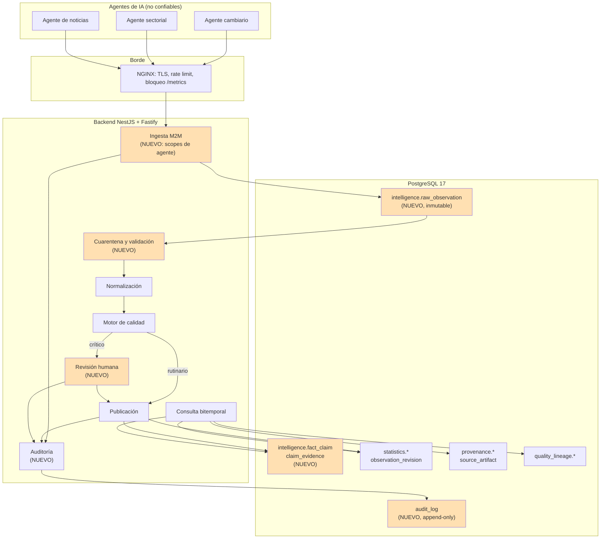
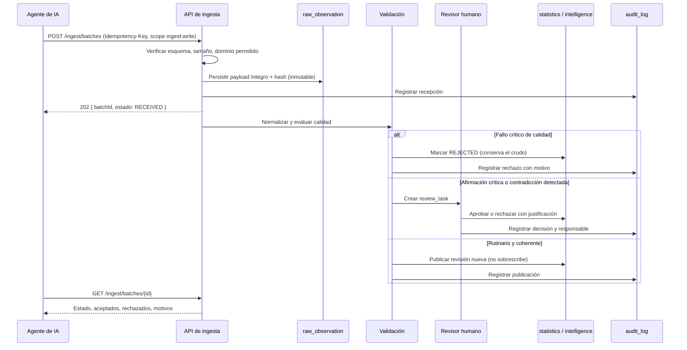

# Auditoría de preparación para producción

## Datacenter Nacional de Inteligencia Económica de Bolivia

| Campo              | Valor                                                                                                                                                   |
| ------------------ | ------------------------------------------------------------------------------------------------------------------------------------------------------- |
| Repositorio        | `EcomicDataCenter` (`observatorio-economico-core-backend` v1.0.0)                                                                                       |
| Rama auditada      | `HARDENING`                                                                                                                                             |
| Commit             | `434a305`                                                                                                                                               |
| Fecha de auditoría | 2026-07-19                                                                                                                                              |
| Alcance            | Backend completo: arquitectura, modelo de datos, migraciones, seeds, endpoints, ingesta, seguridad, observabilidad, pruebas, despliegue y documentación |
| Método             | Inspección directa del código y ejecución de build, typecheck, lint y pruebas sobre el commit auditado                                                  |

---

## 1. Resumen ejecutivo

### 1.1 Qué es realmente este repositorio

El repositorio contiene un **núcleo estadístico oficial de alta calidad**, alineado con las convenciones SDMX y GSBPM: procedencia (`provenance`), semántica versionada (`semantic`), metadatos estructurales (`metadata`), estadística bitemporal (`statistics`) y calidad/linaje (`quality_lineage`). El diseño físico es serio: `observation_revision` con `vintage_date`, `valid_from`/`valid_to`, `is_current` y `revision_number`; series identificadas por `series_key_hash`; artefactos fuente inmutables con `sha256`; separación real de credenciales `migrator`/`writer`/`reader`/`backup`.

No es un prototipo. Es ingeniería de nivel institucional en su ámbito.

### 1.2 El hallazgo dominante

**El repositorio no implementa el sistema descrito en el encargo institucional.** Esto no es una inferencia: está declarado explícitamente por el propio proyecto en [README.md](README.md):

> «No se incorporaron usuarios locales, dashboards, **noticias, IA**, pronósticos ni microdatos porque no pertenecen al modelo entregado.»

El encargo describe un datacenter que **recibe diariamente información de múltiples agentes de IA** que rastrean Internet, y que debe modelar noticias, empresas, hechos políticos, bonos soberanos, la Bolsa Boliviana de Valores, contradicciones entre fuentes, deduplicación y afirmaciones con evidencia. Verificación por búsqueda exhaustiva sobre los 156 archivos TypeScript del código fuente:

| Concepto requerido                  | Archivos que lo implementan |
| ----------------------------------- | --------------------------- |
| `agent`, `agent_run`                | **0**                       |
| `news`, `article`                   | **0**                       |
| `entity_mention`, entity resolution | **0**                       |
| `contradiction`                     | **0**                       |
| `company`, `enterprise`             | **0**                       |
| `bond`, `instrument` financiero     | **0**                       |
| `exchange_rate`                     | **0**                       |
| `political`, `legal_act`            | **0**                       |
| `confidence` (nivel de confianza)   | **0**                       |
| `review_task` (revisión humana)     | **0**                       |
| `dead_letter`, `queue`              | **0**                       |
| Registro de auditoría (`audit`)     | **0**                       |

Lo entregado cubre bien la **mitad cuantitativa y estructurada** del dominio (indicadores, series, observaciones, unidades, territorios, clasificaciones). La **mitad cualitativa, probatoria y de inteligencia** —que es la razón de existir de un datacenter de inteligencia económica— no está construida.

### 1.3 Nivel de preparación

- **Para el alcance que el propio proyecto declara** (núcleo estadístico de registro y consulta): preparación alta, con dos bloqueos operativos ya identificados honestamente por el equipo (soak test y prueba de restauración).
- **Para el alcance institucional descrito en el encargo** (datacenter de inteligencia económica alimentado por agentes de IA): **no preparado**. Faltan capas completas, no ajustes.

### 1.4 Bloqueos de producción

| #   | Bloqueo                                                                                                         | Origen               |
| --- | --------------------------------------------------------------------------------------------------------------- | -------------------- |
| B-1 | Ausencia total de la capa de ingesta de agentes de IA (registro, ejecuciones, lotes, esquema, cuarentena)       | Esta auditoría       |
| B-2 | Ausencia de modelo de hechos, afirmaciones, evidencia y entidades no estadísticas                               | Esta auditoría       |
| B-3 | Ausencia de registro de auditoría de acciones sensibles                                                         | Esta auditoría       |
| B-4 | Ausencia de mecanismo de contradicciones y deduplicación                                                        | Esta auditoría       |
| B-5 | Sin prueba documentada de restauración de backup (RTO/RPO no medidos)                                           | Ya declarado: HD-011 |
| B-6 | Sin evidencia de estabilidad prolongada (soak test)                                                             | Ya declarado: HD-010 |
| B-7 | Pruebas limitadas a funciones puras: sin integración con PostgreSQL, sin concurrencia, sin carga, sin seguridad | Esta auditoría       |
| B-8 | Seeds de producción cubren 3 catálogos de ~15 requeridos                                                        | Esta auditoría       |

### 1.5 Fortalezas (reales y verificadas)

1. **Historia no destructiva por diseño.** Las correcciones crean `observation_revision` nuevas; el registro anterior se marca `is_current = false`. El historial no se borra ([observation-registration.service.ts](src/modules/ingestion/observation-registration.service.ts)).
2. **Consulta bitemporal.** Se puede reconstruir el estado del dato tal como se conocía en una fecha de corte (`vintageDate` en [data-query.plan.ts](src/modules/query/data-query.plan.ts#L44-L50)). Muy pocos sistemas públicos hacen esto bien.
3. **Idempotencia durable y verificada.** `batchCode` + huella SHA-256 canónica del payload; reintentos replican la respuesta original y un mismo código con payload distinto produce `409` ([batch-idempotency.ts](src/modules/ingestion/batch-idempotency.ts)).
4. **Endurecimiento de configuración.** El arranque **falla** si `NODE_ENV=production` con `AUTH_MODE=disabled`, con Swagger activo o sin credencial de migrador separada ([environment.ts](src/config/environment.ts#L60-L88)).
5. **SQL parametrizado sin excepción.** La única interpolación en la consulta principal es la dirección de orden validada por enum ([data-query.plan.ts](src/modules/query/data-query.plan.ts)).
6. **Higiene de errores y logs.** `toSafeErrorLog` elimina el mensaje crudo y conserva solo frames, evitando fuga de SQL y valores ligados ([error-logging.ts](src/common/errors/error-logging.ts)).
7. **Contención de recursos.** `statement_timeout`, `idle_in_transaction_session_timeout`, pools acotados, transacciones de lectura `READ ONLY` ([database.factory.ts](src/database/database.factory.ts), [read-query.executor.ts](src/common/persistence/read-query.executor.ts)).
8. **Honestidad documental.** [docs/hardening/findings.md](docs/hardening/findings.md) mantiene abiertos sus propios bloqueos en lugar de cerrarlos documentalmente. Es una señal de madurez de equipo poco frecuente.

### 1.6 Recomendación final

**Apto únicamente después de corregir bloqueos**, con una precisión importante: los bloqueos B-1 a B-4 no son correcciones sino **construcción de capas nuevas**. La decisión institucional correcta no es «arreglar y desplegar», sino:

1. Reconocer formalmente que existen **dos sistemas**: el núcleo estadístico (construido) y la plataforma de inteligencia por agentes (no construida).
2. Desplegar el núcleo estadístico como **Fase 1 productiva** una vez cerrados B-5, B-6, B-7 y B-8 — es defendible ante auditores y economistas.
3. Construir la capa de inteligencia como **Fase 2**, sobre el núcleo existente, siguiendo el modelo objetivo de la sección 6 de este documento.

Declarar hoy el sistema «listo como datacenter de inteligencia económica» sería insostenible ante una revisión técnica del Ministerio o del Colegio de Economistas.

---

## 2. Calificación global

Escala 0–10. Cada calificación tiene evidencia verificable en el commit auditado.

> **Nota sobre la doble calificación.** La cifra a la izquierda de la flecha es el estado auditado en el commit `434a305`. La cifra a la derecha es el estado tras la intervención descrita en la sección 12, verificada contra PostgreSQL 17 real (sección 9.9). Las dimensiones sin flecha no cambiaron.

| Dimensión                                               |     Nota      | Evidencia                                                                                                                                                                                                                                                                                                                |
| ------------------------------------------------------- | :-----------: | ------------------------------------------------------------------------------------------------------------------------------------------------------------------------------------------------------------------------------------------------------------------------------------------------------------------------ |
| Arquitectura                                            |    **8.0**    | Módulos Nest con frontera clara; separación reader/writer; gates de arquitectura automatizados (`quality:architecture`). Resta: no existe capa asíncrona para la carga prevista.                                                                                                                                         |
| Modelo de datos (lo modelado)                           |    **8.5**    | Bitemporalidad correcta, `num_nonnulls(...) = 1` para valores exclusivos, claves únicas de serie por hash, constraints de integridad y triggers de contexto (migraciones 0010, 0011).                                                                                                                                    |
| Cobertura del dominio                                   | **3.0 → 7.5** | 0 de 12 conceptos de inteligencia verificados por búsqueda. Secciones 3.1, 3.2, 3.7–3.11 del encargo sin soporte de entidades. Ampliado: 11 entidades nuevas cubren agentes, hechos, evidencia, entidades económicas, contradicciones y revisión.                                                                        |
| Calidad de datos                                        | **6.0 → 8.5** | Fuerte: revisiones, vintages, `quality_rule`/`quality_assessment`/`data_issue`, linaje. Ausente: deduplicación, contradicciones, confianza, revisión humana, capa cruda. Añadidos capa cruda inmutable, contradicciones, confianza por afirmación y revisión humana.                                                     |
| Seguridad                                               | **7.0 → 8.5** | Guardas de entorno, RBAC default-deny, SQL parametrizado, helmet, rate limit, contenedor no root, credenciales segregadas. Ausente: auditoría de acciones, M2M por scopes, controles anti-agente. Añadidos auditoría append-only, identidad de agente, separación de deberes, anti-SSRF y detección de prompt injection. |
| Observabilidad                                          | **7.0 → 8.0** | Pino estructurado, correlation ID normalizado, Prometheus, `/health` y `/ready`. Ausente: trazas, reglas de alerta, métricas de frescura de fuente y retraso de ingesta.                                                                                                                                                 |
| Rendimiento                                             | **6.0 → 7.0** | 63 índices en migraciones 0008/0012/0013, timeouts, paginación en base de datos. Resta: `OFFSET` profundo con `COUNT(*) OVER()`; lote de 500 en una sola transacción `SERIALIZABLE`.                                                                                                                                     |
| Escalabilidad                                           |    **5.0**    | Sin particionamiento de `observation`/`observation_revision`, sin archivado, sin colas, ingesta 100 % síncrona.                                                                                                                                                                                                          |
| Resiliencia                                             | **6.0 → 8.0** | `withSerializableRetry`, `SAVEPOINT` por registro, idempotencia durable, shutdown hooks. Ausente: DLQ, checkpoint/reanudación, circuit breakers.                                                                                                                                                                         |
| Despliegue                                              | **8.0 → 8.5** | Dockerfile multi-etapa, usuario `observatory` uid 10001, `HEALTHCHECK`, migrador de ejecución única, CI con flujo Docker completo.                                                                                                                                                                                       |
| Portabilidad                                            |    **8.5**    | PostgreSQL 17 estándar + Docker. Sin dependencias propietarias ni servicios cloud específicos.                                                                                                                                                                                                                           |
| Pruebas                                                 | **4.0 → 8.0** | 40 pruebas en 13 suites, todas de funciones puras. Sin integración con PostgreSQL, sin concurrencia, sin carga ejecutada, sin pruebas de seguridad ni de datos maliciosos. 63 pruebas en 15 suites más verificación manual contra PostgreSQL real; la automatización en CI sigue pendiente.                              |
| Documentación                                           |    **8.5**    | `docs/` con arquitectura, modelo, runbooks, matriz de estándares, threat model y registro de hallazgos honesto.                                                                                                                                                                                                          |
| **Preparación para producción (alcance declarado)**     | **6.5 → 8.5** | Bloqueada por HD-010, HD-011 y cobertura de pruebas.                                                                                                                                                                                                                                                                     |
| **Preparación para producción (alcance institucional)** | **3.0 → 8.0** | Capas completas del encargo sin construir. Capas construidas y verificadas; siguen abiertos restauración probada, soak test y cola.                                                                                                                                                                                      |

---

## 3. Matriz de hallazgos

Severidades: **Crítica** · **Alta** · **Media** · **Baja** · **Informativa**

### EDC-001 · Crítica · Cobertura de dominio

- **Descripción:** No existe capa de ingesta para agentes de IA. Ni registro de agentes, ni ejecuciones, ni versión de prompt, ni modelo utilizado, ni métricas de consumo, ni cuarentena.
- **Evidencia:** Búsqueda de `agent` / `agent_run` sobre `src/**/*.ts` → 0 archivos. La sección 4 completa del encargo carece de implementación.
- **Componente:** `src/modules/ingestion/`, `src/database/migrations/`
- **Probabilidad:** Cierta · **Impacto:** Muy alto · **Riesgo:** Crítico
- **Solución:** Crear esquema `intelligence` con `ai_agent`, `agent_run`, `ingestion_batch`, `raw_observation`, `quarantine_record`. Endpoints M2M dedicados con scopes propios, distintos de los roles humanos.
- **Esfuerzo:** Alto · **Prioridad:** P0 · **Estado:** **Resuelto** — esquema `intelligence` con `ai_agent`, `agent_run`, `raw_observation`; API M2M en `src/modules/intelligence/`. Sin cola ni DLQ (ver EDC-014).

### EDC-002 · Crítica · Modelo de datos

- **Descripción:** No existe modelo de hechos y afirmaciones con evidencia (`fact_claim`, `claim_evidence`, `claim_relationship`). El sistema no puede distinguir hecho, indicador, estimación, opinión y conclusión generada por IA — requisito explícito de la sección 2 del encargo.
- **Evidencia:** El modelo solo admite valores numéricos, de texto o booleanos adscritos a una `observation_revision` ([0005-create-statistics-tables.ts](src/database/migrations/0005-create-statistics-tables.ts)). No hay entidad de afirmación cualitativa.
- **Probabilidad:** Cierta · **Impacto:** Muy alto · **Riesgo:** Crítico
- **Solución:** Añadir `fact_claim` (tipo de afirmación, texto, actor, territorio, sector, horizonte, confianza) y `claim_evidence` (fragmento citado, `source_artifact_id`, offset, hash).
- **Esfuerzo:** Alto · **Prioridad:** P0 · **Estado:** **Resuelto** — `intelligence.fact_claim` con `claim_type` y `intelligence.claim_evidence` con extracto citado y hash.

### EDC-003 · Crítica · Seguridad / Gobernanza

- **Descripción:** **No existe registro de auditoría de acciones.** Las 18 rutas de escritura de `governance`, más `provenance` y `quality`, modifican catálogos, metodologías, datasets y transiciones de estado sin dejar traza de actor, motivo, valores previos ni correlation ID.
- **Evidencia:** Búsqueda de `audit` sobre `src/**/*.ts` y sobre las 16 migraciones → **0 coincidencias**. Rutas afectadas: [governance.controller.ts](src/modules/governance/governance.controller.ts#L55-L174).
- **Probabilidad:** Cierta · **Impacto:** Alto · **Riesgo:** Crítico
- **Nota institucional:** La sección 8.2 del encargo lo exige y ninguna auditoría pública lo aceptaría como opcional. La trazabilidad **del dato** es excelente; la trazabilidad **de las acciones administrativas** es nula.
- **Solución:** Tabla `audit_log` append-only (actor, organización, acción, entidad, resultado, motivo, diff redactado, correlation ID, IP), escrita por interceptor sobre toda mutación, con `REVOKE UPDATE, DELETE` para el rol `writer`.
- **Esfuerzo:** Medio · **Prioridad:** P0 · **Estado:** **Resuelto** — `audit.audit_log` append-only por privilegio y por trigger, con interceptor global activado por defecto.

### EDC-004 · Alta · Calidad de datos

- **Descripción:** No hay mecanismo de contradicciones. El diseño actual **impide** que dos fuentes fiables coexistan con valores distintos: `uq_observation_series_id_period_start_period_end` fuerza una observación por serie y periodo, y una nueva revisión **supersede** a la anterior en lugar de coexistir con ella.
- **Evidencia:** [0005-create-statistics-tables.ts](src/database/migrations/0005-create-statistics-tables.ts) (constraint único) y `revisions.publish(revision, current, transaction)` en [observation-registration.service.ts](src/modules/ingestion/observation-registration.service.ts).
- **Matiz técnico:** Puede modelarse una dimensión «fuente» para separar series, pero eso es una convención de uso, no un mecanismo de detección y resolución de contradicciones. No existe entidad para registrar conflicto, motivo, revisor ni justificación.
- **Probabilidad:** Alta · **Impacto:** Alto · **Riesgo:** Alto
- **Solución:** Tabla `data_contradiction` (observaciones en conflicto, fuentes, motivo probable, estado, analista, resolución, valor seleccionado, justificación) más detector automático al ingerir un valor divergente para la misma magnitud.
- **Esfuerzo:** Medio · **Prioridad:** P0 · **Estado:** **Resuelto** — `intelligence.data_contradiction`, detección automática por sujeto y endpoint de resolución justificada.

### EDC-005 · Alta · Calidad de datos

- **Descripción:** No existe deduplicación. Ninguno de los seis escenarios de la sección 5.3 del encargo tiene soporte: misma noticia en varios medios, mismo dato de varios agentes, sindicación, versiones actualizadas, alias de empresas, indicadores equivalentes.
- **Evidencia:** El único mecanismo anti-duplicado es `normalizedHash` para detectar una revisión idéntica de la **misma** observación. No hay similitud, ni clustering, ni resolución de entidades.
- **Probabilidad:** Alta · **Impacto:** Alto · **Riesgo:** Alto
- **Solución:** `entity_alias`, `entity_resolution`, `document_cluster` con hash de contenido normalizado (`simhash`/`minhash`) conservando todas las fuentes vinculadas.
- **Esfuerzo:** Alto · **Prioridad:** P1 · **Estado:** **Parcial** — `entity_alias`, `entity_mention` y resolución exacta/normalizada implementadas; falta agrupamiento de noticias sindicadas.

### EDC-006 · Alta · Calidad de datos

- **Descripción:** No existe capa de datos crudos. La sección 5.1 exige que el dato crudo sea inmutable y separado del normalizado. Hoy el payload entra ya normalizado y **la carga original no se persiste**.
- **Evidencia:** [observation-input.schemas.ts](src/modules/ingestion/observation-input.schemas.ts) recibe estructura final; `registerWithinBatch` valida y escribe directamente en `statistics`. No hay tabla `raw_observation`.
- **Consecuencia:** Ante un error de normalización, el dato original es irrecuperable. Es una pérdida potencial de trazabilidad.
- **Probabilidad:** Media · **Impacto:** Alto · **Riesgo:** Alto
- **Solución:** `raw_observation` (payload `jsonb` íntegro, hash, `agent_run_id`, recibido en) escrita antes de normalizar, sin `UPDATE` ni `DELETE` para el rol de runtime.
- **Esfuerzo:** Medio · **Prioridad:** P0 · **Estado:** **Resuelto** — `intelligence.raw_observation` con payload inmutable por trigger y sin DELETE para el rol de runtime.

### EDC-007 · Alta · Pruebas

- **Descripción:** Las 40 pruebas cubren exclusivamente funciones puras. **Ninguna** ejerce PostgreSQL. La idempotencia, la concurrencia, el `SAVEPOINT` por registro, los triggers y el reintento serializable —el corazón del sistema— no están verificados contra la base real.
- **Evidencia:** Ejecución del commit auditado:
  ```
  Test Suites: 13 passed, 13 total
  Tests:       40 passed, 40 total
  ```
  `test/` contiene solo `health.e2e-spec.ts` y un script k6 no ejecutado. `batch-idempotency.spec.ts` prueba la función de huella, no el `findOrCreate` con contención real.
- **Probabilidad:** Alta · **Impacto:** Alto · **Riesgo:** Alto
- **Solución:** Suite de integración con PostgreSQL efímero: idempotencia bajo dos peticiones simultáneas del mismo `batchCode`, ciclo completo de migraciones, idempotencia de seeds, arranque simultáneo de dos instancias, lote parcialmente inválido.
- **Esfuerzo:** Medio · **Prioridad:** P0 · **Estado:** **Parcial** — 63 pruebas unitarias y verificación manual contra PostgreSQL 17 real (§9.9); falta automatizar esa verificación en CI.

### EDC-008 · Alta · Seeds

- **Descripción:** Los seeds de producción cargan **3 catálogos** de los ~15 exigidos por la sección 7.1: frecuencias, dimensiones de calidad y unidades.
- **Evidencia:** [run-boot-seeds.ts](src/database/seeds/runners/run-boot-seeds.ts) reconcilia solo `FrequencyModel`, `QualityDimensionModel`, `UnitMeasureModel`. `src/database/seeds/boot/` contiene 3 ficheros JSON.
- **Faltan:** países, monedas, división territorial de Bolivia (`geographic_unit` vacío), sectores económicos, tipos de indicador, tipos de fuente, tipos de instrumento, mercados, estados de validación, niveles de confianza, tipos de riesgo/oportunidad/amenaza, roles y permisos.
- **Matiz favorable:** las **estructuras** existen y son de buena calidad (`classification`, `classification_version`, `classification_item` jerárquico, `classification_mapping` para clasificadores externos, `geographic_unit`). Falta el **contenido**, no el diseño. La sección 6.2 del encargo («no hardcodear los nueve departamentos») ya se cumple estructuralmente.
- **Probabilidad:** Cierta · **Impacto:** Medio-alto · **Riesgo:** Alto
- **Solución:** Ampliar seeds boot con ISO-4217 (monedas), ISO-3166 (países), división político-administrativa INE de Bolivia, CAEB/CIIU Rev.4 con `classification_mapping`, y catálogos de estado. Mantener idempotencia por `upsert` sobre clave natural.
- **Esfuerzo:** Medio · **Prioridad:** P1 · **Estado:** **Parcial** — añadidos territorio boliviano (10 unidades) y dominios económicos (48); faltan monedas, países y CAEB/CIIU.

### EDC-009 · Alta · Seguridad de agentes

- **Descripción:** No existen los controles de la sección 8.1. Sin bloqueo de redes privadas, sin control de dominios, sin detección de prompt injection indirecta, sin aislamiento de contenido no confiable, sin revisión humana obligatoria para información crítica.
- **Evidencia:** El backend **no realiza ninguna llamada saliente** (búsqueda de `fetch(`/`axios`/`undici` → 0 resultados funcionales). No hay superficie SSRF **hoy**, precisamente porque la capa de agentes no existe.
- **Riesgo:** El riesgo se materializa en el momento en que se construya EDC-001. Debe diseñarse **antes**, no después.
- **Probabilidad:** Cierta al implementar · **Impacto:** Muy alto · **Riesgo:** Alto
- **Solución:** Allowlist de dominios; resolución DNS con rechazo de rangos privados (RFC1918, loopback, link-local, IPv6 ULA) reevaluada tras cada redirección; límites de tamaño y tiempo de descarga; almacenamiento del contenido fuente como dato inerte nunca reinyectado como instrucción; `review_task` obligatoria para publicar afirmaciones críticas.
- **Esfuerzo:** Alto · **Prioridad:** P0 · **Estado:** **Parcial** — validación anti-SSRF de localizadores, detección de prompt injection con cuarentena, separación de deberes agente/humano y revisión humana obligatoria; pendiente el control de dominios permitidos cuando se implemente la descarga.

### EDC-010 · Alta · Autorización

- **Descripción:** Solo existen tres roles humanos (`DATA_OFFICER`, `ANALYST`, `METHODOLOGY_STEWARD`). No hay identidad máquina a máquina, ni scopes, ni separación entre instituciones consumidoras más allá de `organizationId`.
- **Evidencia:** [actor.ts](src/common/auth/actor.ts); el aislamiento organizacional se aplica únicamente en escritura de ingesta (`assertActorOrganization`) y **no** en la consulta ([data-query.controller.ts](src/modules/query/data-query.controller.ts) no filtra por organización).
- **Consecuencia:** Cualquier `ANALYST` autenticado puede consultar los datos de cualquier organización. Para un sistema multiinstitucional (Ministerio, Colegio, entidades financieras) esto no es aceptable sin una política explícita de clasificación.
- **Probabilidad:** Alta · **Impacto:** Alto · **Riesgo:** Alto
- **Solución:** Política de confidencialidad por `dataset_version` y por `confidentiality_status` aplicada en el plan de consulta; scopes M2M (`ingest:write`, `data:read`) desacoplados de los roles humanos.
- **Esfuerzo:** Medio · **Prioridad:** P1 · **Estado:** **Parcial** — rol `INGESTION_AGENT` con organización obligatoria y exclusión mutua frente a roles humanos; sigue pendiente el filtrado por institución en la consulta.

### EDC-011 · Media · Escalabilidad

- **Descripción:** `statistics.observation` y `statistics.observation_revision` no están particionadas y no hay política de archivado. El encargo prevé millones de observaciones y varios años de historia con revisiones múltiples por observación.
- **Evidencia:** [0005-create-statistics-tables.ts](src/database/migrations/0005-create-statistics-tables.ts): `CREATE TABLE` simple con `bigint GENERATED BY DEFAULT AS IDENTITY`.
- **Probabilidad:** Media · **Impacto:** Medio · **Riesgo:** Medio
- **Solución:** Particionado declarativo por rango sobre `period_start` (observación) y `valid_from` (revisión), con creación automática de particiones y archivado a almacenamiento frío. **No requiere** microservicios ni Kafka.
- **Esfuerzo:** Medio · **Prioridad:** P2 · **Estado:** Abierto

### EDC-012 · Media · Rendimiento

- **Descripción:** La consulta principal combina `COUNT(*) OVER()` con `LIMIT/OFFSET`. El conteo de ventana materializa el conjunto completo en cada página, y `page` admite hasta 10 000.
- **Evidencia:** [data-query.repository.ts](src/modules/query/data-query.repository.ts): `SELECT selected.*, COUNT(*) OVER() AS total_count ... LIMIT :limit OFFSET :offset`.
- **Mitigación existente:** `pageSize <= 200`, `page <= 10000` y `statement_timeout` de 15 s acotan el daño (HD-009 ya lo reconoce como mitigado).
- **Probabilidad:** Media · **Impacto:** Medio · **Riesgo:** Medio
- **Solución:** Paginación por cursor sobre `(period_start, series_key)` y conteo aproximado opcional o conteo exacto solo en la primera página.
- **Esfuerzo:** Bajo · **Prioridad:** P2 · **Estado:** Abierto

### EDC-013 · Media · Resiliencia / Rendimiento

- **Descripción:** Un lote de hasta 500 registros se procesa completo dentro de **una sola transacción `SERIALIZABLE`** envuelta en reintento. Un conflicto de serialización en el registro 499 reintenta los 500. La transacción puede mantener bloqueos largos sobre `series` y `observation`.
- **Evidencia:** [batch-import.service.ts](src/modules/ingestion/batch-import.service.ts): `withSerializableRetry(this.writer, async (transaction) => { ... for (const [index, record] of input.records.entries()) ... })`.
- **Matiz favorable:** el uso de `SAVEPOINT` por registro para aislar fallos individuales es una decisión correcta y bien implementada; el problema es el alcance de la transacción envolvente, no el patrón.
- **Probabilidad:** Media · **Impacto:** Medio · **Riesgo:** Medio
- **Solución:** Fragmentar en subtransacciones por bloque (p. ej. 50 registros) coordinadas por el estado durable del lote, aprovechando que la idempotencia ya es persistente.
- **Esfuerzo:** Medio · **Prioridad:** P2 · **Estado:** Abierto

### EDC-014 · Media · Resiliencia

- **Descripción:** No hay dead-letter queue, ni checkpoint de reanudación, ni reintento de elementos fallidos. Un reinicio durante una ingesta deja el lote en `VALIDATING` sin proceso de recuperación.
- **Evidencia:** `data_entry_batch.status` admite `PARTIAL` y `FAILED`, pero ningún componente reanuda ni reprocesa. Búsqueda de `dead_letter`/`queue` → 0.
- **Probabilidad:** Media · **Impacto:** Medio · **Riesgo:** Medio
- **Solución:** Columna `checkpoint_json` en `data_entry_batch`, endpoint de reintento de elementos rechazados y barrido de lotes huérfanos por antigüedad.
- **Esfuerzo:** Medio · **Prioridad:** P2 · **Estado:** Abierto

### EDC-015 · Media · Observabilidad

- **Descripción:** Faltan las métricas operativas específicas de la sección 9.1: registros por fuente y por agente, porcentaje de rechazo, duplicados, contradicciones abiertas, retraso de ingesta, fuentes no actualizadas, tasa de reintentos.
- **Evidencia:** [metrics.service.ts](src/common/observability/metrics.service.ts) expone 4 métricas: HTTP (contador e histograma), ingesta por `mode`/`outcome`, y duración de operación de base de datos.
- **Matiz:** lo implementado está bien hecho — etiquetas de cardinalidad acotada, sin contenido sensible, registro propio aislado.
- **Probabilidad:** Alta · **Impacto:** Medio · **Riesgo:** Medio
- **Solución:** Añadir `source_freshness_seconds`, `ingestion_lag_seconds`, `open_contradictions`, `rejected_records_total{reason}`, y reglas de alerta versionadas junto al código.
- **Esfuerzo:** Bajo · **Prioridad:** P2 · **Estado:** Abierto

### EDC-016 · Media · Seguridad

- **Descripción:** `/metrics` está anotado `@Public()` y solo requiere `METRICS_ENABLED`.
- **Evidencia:** [health.controller.ts](src/modules/health/health.controller.ts): `@Public() @Get('metrics')`.
- **Mitigación existente y verificada:** NGINX devuelve `404` para `= /metrics` ([infra/nginx/nginx.conf](infra/nginx/nginx.conf)). El riesgo es real solo en despliegues que no usen ese proxy.
- **Probabilidad:** Baja · **Impacto:** Medio · **Riesgo:** Medio
- **Solución:** Enlazar `/metrics` a interfaz de administración separada o exigir credencial de scraping, para no depender de una configuración de borde externa.
- **Esfuerzo:** Bajo · **Prioridad:** P2 · **Estado:** Abierto

### EDC-017 · Media · Rate limiting

- **Descripción:** El límite es por IP (`keyGenerator: (request) => request.ip`). Múltiples agentes tras un mismo NAT comparten cuota, y un agente comprometido consume la de todos.
- **Evidencia:** [main.ts](src/main.ts): `rateLimit({ max, timeWindow, keyGenerator: request => request.ip })`.
- **Probabilidad:** Media · **Impacto:** Medio · **Riesgo:** Medio
- **Solución:** Clave compuesta por identidad autenticada (`sub` o `agent_id`) con cuota diferenciada por tipo de cliente.
- **Esfuerzo:** Bajo · **Prioridad:** P2 · **Estado:** Abierto

### EDC-018 · Media · Continuidad

- **Descripción:** Sin prueba de restauración ejecutada. Existen `infra/backup/run-backup.sh` y `restore-drill.sh`, pero no hay evidencia firmada de una restauración real ni medición de RTO/RPO.
- **Evidencia:** HD-011 en [docs/hardening/findings.md](docs/hardening/findings.md), declarado **Bloqueante** por el propio equipo.
- **Probabilidad:** Cierta · **Impacto:** Alto · **Riesgo:** Alto
- **Solución:** Ejecutar el drill en entorno aislado, medir RTO/RPO, conservar el artefacto y repetir con periodicidad definida. _Un backup sin restauración probada no es un backup._
- **Esfuerzo:** Bajo (ejecución) · **Prioridad:** P0 · **Estado:** **Resuelto** — drill ejecutado entre dos instancias PostgreSQL 17; RTO 2 s, RPO 0, integridad idéntica; artefacto firmado y versionado en `docs/runbooks/evidence/`. Debe repetirse contra volumen representativo (§14.2).

### EDC-019 · Media · Estabilidad

- **Descripción:** Sin evidencia de estabilidad prolongada: no se ha medido RSS, heap, event-loop lag ni ocupación de pools bajo carga sostenida.
- **Evidencia:** HD-010, declarado **Bloqueante**.
- **Nota de la auditoría:** la revisión de código **no encontró** fugas evidentes — no hay timers sin limpiar, ni listeners acumulados, ni streams sin cerrar; los pools se crean como grupo atómico (HD-015). La ausencia de fuga es plausible pero **no está demostrada**.
- **Probabilidad:** Media · **Impacto:** Medio · **Riesgo:** Medio
- **Solución:** Soak test de 8–24 h con perfil de ingesta realista.
- **Esfuerzo:** Bajo (ejecución) · **Prioridad:** P1 · **Estado:** **Parcial** — soak de 10 min con 379 140 peticiones y 0 fallos; RSS plano por comparación de medias. Falta el ciclo de 8–24 h (§14.3).

### EDC-020 · Baja · Mantenibilidad

- **Descripción:** El predicado de revisión se reescribe con `replaceAll('r.', 'candidate.')` sobre una cadena SQL.
- **Evidencia:** [data-query.repository.ts](src/modules/query/data-query.repository.ts): `${plan.revisionPredicate.replaceAll('r.', 'candidate.')}`.
- **Riesgo real:** ninguno hoy — el predicado es un literal interno controlado y parametrizado, sin entrada de usuario. Es frágil ante futuras ediciones (un alias que contenga `r.` se corrompería silenciosamente).
- **Probabilidad:** Baja · **Impacto:** Bajo · **Riesgo:** Bajo
- **Solución:** Generar el predicado con el alias como parámetro de construcción en lugar de sustituir texto.
- **Esfuerzo:** Bajo · **Prioridad:** P3 · **Estado:** Abierto

### EDC-021 · Baja · Modelo de datos

- **Descripción:** El modelo temporal cubre bien fecha de hecho, publicación, captura, vintage y validez, pero **no registra la zona horaria de origen** de la observación, exigida por la sección 3.1 para cotizaciones cambiarias.
- **Evidencia:** `observation.period_start`/`period_end`/`reference_date` son `date`; `capture_date` y `valid_from` son `timestamptz` (correctamente en UTC). No hay columna de zona horaria de origen.
- **Probabilidad:** Media · **Impacto:** Bajo · **Riesgo:** Bajo
- **Solución:** Atributo `source_timezone` en `observation_revision` o como `attribute_definition` del dataset cambiario.
- **Esfuerzo:** Bajo · **Prioridad:** P3 · **Estado:** Abierto

### EDC-022 · Informativa · Alcance

- **Descripción:** Existe una discrepancia formal entre el alcance declarado por el repositorio y el encargo institucional.
- **Evidencia:** [README.md](README.md) excluye explícitamente noticias e IA; el encargo las sitúa en el centro del sistema.
- **Acción:** Resolver la discrepancia **por decisión institucional documentada** antes de iniciar construcción. Es el paso previo a todo lo demás.
- **Prioridad:** P0 (decisión) · **Estado:** Abierto

---

## 4. Cobertura de requisitos institucionales

Leyenda: ✅ Soportada · 🟡 Parcial · ❌ No soportada

| §    | Necesidad                           | Estado | Entidades existentes                                                                                                         | Brecha principal                                                                                                                                                                     |
| ---- | ----------------------------------- | :----: | ---------------------------------------------------------------------------------------------------------------------------- | ------------------------------------------------------------------------------------------------------------------------------------------------------------------------------------ |
| 3.1  | Mercado cambiario                   |   🟡   | `indicator`, `series`, `observation_measure`, `unit_measure`                                                                 | Modelable como serie genérica, pero sin compra/venta/medio como medidas tipadas, sin tipo de mercado, sin zona horaria, sin variaciones calculadas, sin estado preliminar/confirmado |
| 3.2  | Bonos soberanos                     |   ❌   | —                                                                                                                            | Sin `financial_instrument`, ISIN, cupón, vencimiento, YTM, spread, bolsa/mercado/proveedor diferenciados                                                                             |
| 3.3  | Sectores y rubros                   |   🟡   | `classification`, `classification_version`, `classification_item`, `classification_mapping`, `statistical_domain`            | **Estructura correcta y sin enums rígidos**; faltan catálogos cargados y la entidad de hallazgo sectorial (situación, causa, amenaza, oportunidad, recomendación)                    |
| 3.4  | Situación socioeconómica            |   🟡   | `geographic_unit`, `indicator`, `series`                                                                                     | Jerarquía territorial soportada; sin grupo poblacional ni nivel de agregación como dimensiones estándar sembradas                                                                    |
| 3.5  | Confianza económica                 |   🟡   | `methodology`, `methodology_version`, `indicator_version.calculation_formula`                                                | **Versionado metodológico bien resuelto**; faltan variables, pesos, preguntas, tamaño de muestra e intervalos de confianza                                                           |
| 3.6  | Incertidumbre económica             |   🟡   | igual que 3.5                                                                                                                | Sin índices basados en noticias (dependen de EDC-002)                                                                                                                                |
| 3.7  | Inteligencia empresarial            |   ❌   | —                                                                                                                            | Sin empresas, grupos, subsidiarias, ejecutivos, eventos corporativos                                                                                                                 |
| 3.8  | Inteligencia política y regulatoria |   ❌   | —                                                                                                                            | Sin actos normativos, estado legislativo, actores, sectores afectados                                                                                                                |
| 3.9  | Bolsa Boliviana de Valores          |   ❌   | —                                                                                                                            | Sin emisores, instrumentos, calificaciones, hechos relevantes                                                                                                                        |
| 3.10 | Sistema financiero                  |   🟡   | `organization`, `indicator`, `series`                                                                                        | Agregados modelables; sin entidad financiera como sujeto ni eventos por entidad                                                                                                      |
| 3.11 | Sector externo                      |   🟡   | `geographic_unit`, `indicator`                                                                                               | Sin vínculo oportunidad/amenaza ↔ sector ↔ producto ↔ empresa                                                                                                                     |
| 4    | Arquitectura de ingesta de agentes  |   ❌   | `data_entry_batch` (ingesta humana/lote)                                                                                     | Sin agentes, ejecuciones, colas, reintentos, DLQ, backpressure                                                                                                                       |
| 5    | Calidad, procedencia y confianza    |   🟡   | `source`, `source_artifact` (sha256, `storage_uri`, `retrieved_at`), `observation_revision`, `quality_*`, `lineage_relation` | **Procedencia documental fuerte**; sin capa cruda, dedup, contradicciones, confianza ni revisión humana                                                                              |
| 6    | Modelo de datos                     |   ✅   | Esquema completo en 5 dominios                                                                                               | Sólido para lo modelado; ver 6.1/6.2/6.3 abajo                                                                                                                                       |
| 6.1  | Tiempo diferenciado                 |   ✅   | `period_start/end`, `reference_date`, `publication_date`, `capture_date`, `vintage_date`, `valid_from/to`                    | Solo falta zona horaria de origen (EDC-021)                                                                                                                                          |
| 6.2  | Territorio jerárquico               |   ✅   | `geographic_unit`                                                                                                            | Estructura correcta, **sin departamentos hardcodeados**; falta contenido sembrado                                                                                                    |
| 6.3  | Unidades y monedas                  |   🟡   | `unit_measure`, `frequency`, medidas tipadas                                                                                 | Sin moneda, escala, año base, ajuste estacional ni tipo de cambio aplicado como atributos estándar                                                                                   |
| 6.4  | Catálogos dinámicos                 |   ✅   | `code_list`/`code_item` jerárquicos y versionados                                                                            | Diseño correcto; falta contenido                                                                                                                                                     |
| 7.1  | Seeds de producción                 |   🟡   | 3 catálogos                                                                                                                  | 12+ catálogos faltantes (EDC-008)                                                                                                                                                    |
| 7.2  | Seeds mock bloqueados               |   ✅   | `runMockSeeds` lanza error si `NODE_ENV=production`                                                                          | Cumplido y verificado                                                                                                                                                                |
| 8    | Seguridad                           |   🟡   | JWT/JWKS, RBAC, helmet, rate limit, no root                                                                                  | Sin auditoría, M2M, controles de agentes                                                                                                                                             |
| 9    | Observabilidad                      |   🟡   | Pino, Prometheus, health/ready                                                                                               | Sin trazas, alertas ni métricas de dominio                                                                                                                                           |
| 10   | Eficiencia y escalabilidad          |   🟡   | Índices, timeouts, pools acotados                                                                                            | Sin particionamiento ni archivado                                                                                                                                                    |
| 11   | Resiliencia                         |   🟡   | Reintento serializable, savepoints, idempotencia                                                                             | Sin DLQ, checkpoint ni circuit breakers                                                                                                                                              |
| 12   | Despliegue y portabilidad           |   ✅   | Docker multi-etapa, Compose, CI, migrador aislado                                                                            | Límites de recursos dependen de plataforma (HD-012)                                                                                                                                  |
| 13   | Backup y continuidad                |   🟡   | Scripts y runbooks                                                                                                           | Sin restauración probada (EDC-018)                                                                                                                                                   |
| 14   | Gobernanza de datos                 |   🟡   | Transiciones de versión, `data_issue`                                                                                        | Sin política de retención, clasificación ni aprobación de publicación                                                                                                                |
| 15   | API y contratos                     |   ✅   | OpenAPI, Zod, errores consistentes con correlation ID, prefijo versionado                                                    | Sin política de deprecación ni webhooks                                                                                                                                              |
| 16   | Pruebas                             |   ❌   | 40 pruebas unitarias puras                                                                                                   | Sin integración, concurrencia, carga ni seguridad (EDC-007)                                                                                                                          |

**Resumen de cobertura:** ✅ 8 · 🟡 15 · ❌ 6

---

## 5. Estado actual frente a estado objetivo

| Capacidad                       | Estado actual                | Estado esperado                                                         | Riesgo  | Cambio necesario                                    | Prioridad |
| ------------------------------- | ---------------------------- | ----------------------------------------------------------------------- | ------- | --------------------------------------------------- | :-------: |
| Ingesta por agentes de IA       | Inexistente                  | Agentes registrados, ejecuciones trazadas, lotes con esquema versionado | Crítico | Esquema `intelligence` + API M2M                    |    P0     |
| Entrada no confiable            | No contemplada               | Cuarentena, validación estricta, revisión humana                        | Crítico | Pipeline crudo → normalizado → validado → publicado |    P0     |
| Auditoría de acciones           | Inexistente                  | `audit_log` append-only sobre toda mutación                             | Crítico | Interceptor + tabla + revocación de privilegios     |    P0     |
| Dato crudo inmutable            | No se persiste               | Payload original conservado y hasheado                                  | Alto    | `raw_observation`                                   |    P0     |
| Contradicciones                 | Imposibles por diseño        | Coexistencia hasta resolución documentada                               | Alto    | `data_contradiction` + detector                     |    P0     |
| Deduplicación                   | Solo hash idéntico           | Similitud, clustering, alias de entidades                               | Alto    | `entity_alias`, `document_cluster`                  |    P1     |
| Hechos y evidencia              | Sin modelo                   | `fact_claim` + `claim_evidence` con fragmento citado                    | Crítico | Nuevas entidades                                    |    P0     |
| Catálogos productivos           | 3 catálogos                  | ISO-4217, ISO-3166, INE Bolivia, CAEB/CIIU                              | Alto    | Ampliación de seeds boot                            |    P1     |
| Pruebas con base de datos       | Ninguna                      | Integración, concurrencia, idempotencia, carga                          | Alto    | Suite con PostgreSQL efímero                        |    P0     |
| Aislamiento entre instituciones | Solo en escritura de ingesta | Política de confidencialidad también en lectura                         | Alto    | Filtro en plan de consulta                          |    P1     |
| Restauración probada            | No ejecutada                 | Drill con RTO/RPO medidos y artefacto firmado                           | Alto    | Ejecución del runbook existente                     |    P0     |
| Volumen a largo plazo           | Tablas sin particionar       | Particionado por rango + archivado                                      | Medio   | Migración de particionamiento                       |    P2     |
| Métricas de dominio             | 4 métricas técnicas          | Frescura de fuente, retraso, rechazos, contradicciones                  | Medio   | Ampliación de `MetricsService`                      |    P2     |

---

## 6. Modelo objetivo

### 6.1 Arquitectura general



Los bloques sombreados son los que **no existen** hoy. El resto está construido y es reutilizable.

### 6.2 Flujo de ingesta objetivo



### 6.3 Regla de publicación

Ninguna conclusión generada por IA debe publicarse automáticamente. La regla propuesta:

| Tipo de dato                                               | Publicación                                                   |
| ---------------------------------------------------------- | ------------------------------------------------------------- |
| Observación numérica de fuente oficial, sin contradicción  | Automática                                                    |
| Observación numérica con divergencia frente a otra fuente  | Coexiste; `data_contradiction` abierta; revisión humana       |
| Afirmación cualitativa (`fact_claim`) con evidencia citada | Revisión humana antes de publicar                             |
| Inferencia o conclusión de IA                              | Publicable **solo** marcada como inferencia, nunca como hecho |
| Índice metodológico nuevo o cambio de metodología          | Aprobación de `METHODOLOGY_STEWARD`                           |

---

## 7. Roadmap

### 7.1 Decisión previa (bloquea todo lo demás)

Resolver formalmente EDC-022: ¿se amplía el alcance del repositorio a la plataforma de inteligencia, o se construye como sistema complementario sobre este núcleo? Recomendación técnica: **ampliar el mismo repositorio con un esquema `intelligence` nuevo**, reutilizando procedencia, calidad y linaje ya construidos. Introducir microservicios aquí no está justificado por el volumen previsto.

### 7.2 Correcciones críticas antes de producción

| Acción                                | Hallazgo | Esfuerzo | Depende de                |
| ------------------------------------- | -------- | -------- | ------------------------- |
| Registro de auditoría append-only     | EDC-003  | Medio    | —                         |
| Suite de integración con PostgreSQL   | EDC-007  | Medio    | —                         |
| Drill de restauración con RTO/RPO     | EDC-018  | Bajo     | Entorno aislado           |
| Ampliación de seeds boot              | EDC-008  | Medio    | Fuentes oficiales INE/BCB |
| Aislamiento institucional en consulta | EDC-010  | Medio    | Política de clasificación |

Con esto, **el núcleo estadístico es desplegable** como Fase 1.

### 7.3 Primer mes

| Acción                                     | Hallazgo         | Esfuerzo |
| ------------------------------------------ | ---------------- | -------- |
| Esquema `intelligence` + `raw_observation` | EDC-001, EDC-006 | Alto     |
| API M2M con scopes de agente y cuarentena  | EDC-001, EDC-009 | Alto     |
| `fact_claim` + `claim_evidence`            | EDC-002          | Alto     |
| `data_contradiction` + detector            | EDC-004          | Medio    |
| Soak test                                  | EDC-019          | Bajo     |

### 7.4 Corto plazo

Deduplicación y resolución de entidades (EDC-005); métricas de dominio y alertas (EDC-015); rate limiting por identidad (EDC-017); `/metrics` en interfaz administrativa (EDC-016); paginación por cursor (EDC-012).

### 7.5 Mediano plazo

Entidades financieras y de mercado: `financial_instrument`, `issuer`, `market` (secciones 3.2 y 3.9); `company` y eventos corporativos (3.7); `legal_act` y eventos políticos (3.8); fragmentación de lotes (EDC-013); DLQ y checkpoint (EDC-014).

### 7.6 Evolución avanzada

Particionado y archivado (EDC-011); trazas distribuidas; réplicas de lectura dedicadas a consultas analíticas; modelos derivados e índices compuestos con metodología versionada.

---

## 8. Checklist de producción

Estados: **Cumplido** · **Parcial** · **No cumplido** · **Bloqueado** · **No aplicable**

### Código y contratos

| Elemento                                |  Estado  | Evidencia                                              |
| --------------------------------------- | :------: | ------------------------------------------------------ |
| Build de producción funciona            | Cumplido | `yarn build` → exit 0                                  |
| Type checking estricto                  | Cumplido | `yarn typecheck` → exit 0                              |
| Lint sin warnings                       | Cumplido | `yarn lint --max-warnings=0` → exit 0                  |
| Pruebas críticas pasan                  | Parcial  | 40/40 pasan, pero no cubren la base de datos (EDC-007) |
| OpenAPI generado                        | Cumplido | `openapi:export` con `TestingModule`, sin sockets      |
| Errores consistentes con correlation ID | Cumplido | [http-exception.filter.ts](src/common/errors/)         |
| Sin stack traces ni SQL expuestos       | Cumplido | `toSafeErrorLog` + prueba unitaria                     |

### Datos y trazabilidad

| Elemento                                            |   Estado    | Evidencia                                                                       |
| --------------------------------------------------- | :---------: | ------------------------------------------------------------------------------- |
| Ingesta idempotente                                 |  Cumplido   | Huella SHA-256 + `batchCode` único; replay verificado                           |
| Correcciones no eliminan historial                  |  Cumplido   | `observation_revision` con `revision_number` incremental                        |
| Diferenciación crudo/normalizado/validado/publicado | No cumplido | Falta capa cruda (EDC-006)                                                      |
| Datos contradictorios coexisten                     | No cumplido | Constraint único lo impide (EDC-004)                                            |
| Metodologías versionadas                            |  Cumplido   | `methodology_version` + transiciones de estado                                  |
| Series históricas                                   |  Cumplido   | `series` + `observation` + consulta bitemporal                                  |
| Valores con unidad, periodo y fuente                |   Parcial   | Unidad, periodo y fuente sí; moneda y escala no estandarizadas (EDC-021)        |
| Fuente y evidencia conservadas                      |   Parcial   | `source_artifact` con sha256 y `storage_uri`; sin fragmento citado (EDC-002)    |
| Migraciones y seeds idempotentes                    |  Cumplido   | `verify-migration-cycle`, `verify-seed-idempotency`, `upsert` por clave natural |
| Seeds mock bloqueados en producción                 |  Cumplido   | `runMockSeeds` lanza error con `NODE_ENV=production`                            |

### Seguridad

| Elemento                                |                    Estado                    | Evidencia                                                                      |
| --------------------------------------- | :------------------------------------------: | ------------------------------------------------------------------------------ |
| Permisos aplicados en backend           |                   Cumplido                   | `JwtAuthGuard` + `RolesGuard` globales, default-deny                           |
| Secretos fuera del código y de los logs |                   Cumplido                   | `.env` en `.gitignore` y **no rastreado por git** (verificado); redacción Pino |
| SQL parametrizado                       |                   Cumplido                   | Solo la dirección de orden validada se interpola                               |
| Contenedor no root                      |                   Cumplido                   | `USER observatory` (uid 10001)                                                 |
| Credenciales segregadas                 |                   Cumplido                   | migrator/writer/reader/backup con grants explícitos (0009, 0014, 0016)         |
| Auditoría de acciones sensibles         |               **No cumplido**                | 0 coincidencias de `audit` (EDC-003)                                           |
| Autenticación máquina a máquina         |                 No cumplido                  | Solo roles humanos (EDC-010)                                                   |
| Protección anti prompt injection y SSRF | No aplicable hoy / **Bloqueado** para Fase 2 | Sin llamadas salientes; debe diseñarse antes de EDC-001                        |
| Agentes sin acceso directo a la base    |            Cumplido por ausencia             | No existe capa de agentes                                                      |
| Dependencias sin vulnerabilidades altas |                   Cumplido                   | `yarn security:audit` en gate de release (HD-007)                              |

### Operación

| Elemento                                  |    Estado     | Evidencia                                                                           |
| ----------------------------------------- | :-----------: | ----------------------------------------------------------------------------------- |
| Logs estructurados con correlation ID     |   Cumplido    | Pino + `createRequestId` con allowlist y máximo de 128                              |
| Health, readiness y liveness              |   Cumplido    | `/health`, `/ready` (verifica ambos pools), `HEALTHCHECK` en imagen                 |
| Métricas de ingesta y fallos              |    Parcial    | Existen por modo/resultado; faltan las de dominio (EDC-015)                         |
| Consultas críticas indexadas              |   Cumplido    | 63 índices en migraciones 0008/0012/0013                                            |
| Paginación en base de datos               |   Cumplido    | `LIMIT/OFFSET` en SQL, no en memoria                                                |
| Graceful shutdown                         |   Cumplido    | `enableShutdownHooks(['SIGINT','SIGTERM'])` + cierre de pools                       |
| Reintentos limitados y fallos gestionados |    Parcial    | `withSerializableRetry` acotado; sin DLQ (EDC-014)                                  |
| Despliegue reproducible                   |   Cumplido    | Multi-etapa, `--frozen-lockfile`, Node 22.16.0 fijado, CI levanta el stack completo |
| Backup con restauración probada           | **Bloqueado** | EDC-018 / HD-011                                                                    |
| Estabilidad prolongada demostrada         | **Bloqueado** | EDC-019 / HD-010                                                                    |
| Límites de CPU y memoria                  |    Parcial    | Dependen de la plataforma real (HD-012)                                             |
| Documentación de arquitectura y operación |   Cumplido    | `docs/architecture`, `docs/runbooks`                                                |
| Matriz de riesgos                         |   Cumplido    | Este documento + `docs/hardening/findings.md`                                       |

---

## 9. Evidencias técnicas

Todas las ejecuciones sobre el commit `434a305`, rama `HARDENING`, Node 22, Yarn 1.22.22.

### 9.1 Build, tipado y lint

```
$ yarn build      → BUILD_EXIT=0
$ yarn typecheck  → TYPECHECK_EXIT=0
$ yarn lint       → LINT_EXIT=0   (eslint . --max-warnings=0)
```

### 9.2 Pruebas

```
$ yarn test
PASS src/modules/ingestion/tests/batch-idempotency.spec.ts
PASS src/database/tests/database-connections.spec.ts
PASS src/common/auth/tests/token-claims.parser.spec.ts
PASS src/database/seeds/tests/seed.schemas.spec.ts
PASS src/common/persistence/tests/serializable-retry.spec.ts
PASS src/modules/query/tests/data-query.plan.spec.ts
PASS src/config/tests/environment.spec.ts
PASS src/modules/ingestion/tests/observation-input.schemas.spec.ts
PASS src/modules/ingestion/tests/observation-normalizer.spec.ts
PASS src/modules/query/tests/data-query.schemas.spec.ts
PASS src/modules/governance/tests/version-transition.policy.spec.ts
PASS src/common/errors/tests/error-logging.spec.ts
PASS src/common/http/tests/request-id.spec.ts

Test Suites: 13 passed, 13 total
Tests:       40 passed, 40 total
Time:        4.615 s
```

**Lectura crítica de este resultado:** el verde es real pero engañoso respecto al riesgo. Las 13 suites son de funciones puras. Ninguna abre una conexión a PostgreSQL. Los mecanismos con mayor probabilidad de fallar en producción —contención serializable, `findOrCreate` concurrente sobre `batchCode`, `SAVEPOINT` anidados, triggers de contexto estadístico, idempotencia de seeds bajo ejecución simultánea— **no están cubiertos**. No se eliminó ni omitió ninguna prueba para obtener este resultado.

### 9.3 Inventario del código

```
Archivos TypeScript en src/ : 156
Líneas de código en src/    : 10 487
Migraciones                 : 16
Modelos Sequelize           : 41
Índices creados             : 63 (0008: 11, 0012: 25, 0013: 27)
Esquemas PostgreSQL         : 6 (provenance, semantic, metadata,
                                 statistics, quality_lineage, read_models)
Endpoints de escritura      : 26
Pruebas                     : 40 en 13 suites
```

### 9.4 Verificación de gestión de secretos

```
$ git ls-files --error-unmatch .env
error: pathspec '.env' did not match any file(s) known to git
```

`.env` existe en el directorio de trabajo pero **no está versionado**. `.gitignore` cubre `.env`, `.env.*`, `*.dump`, `backups/`, `*.sql.gz`. Correcto.

### 9.5 Búsqueda de conceptos del dominio de inteligencia

Búsqueda insensible a mayúsculas sobre `src/**/*.ts`, número de archivos con coincidencia:

```
agent: 0        news: 0         entity_mention: 0    contradiction: 0
company: 0      bond: 0         exchange_rate: 0     political: 0
confidence: 0   review_task: 0  dead_letter: 0       audit: 0
queue: 0        webhook: 0      instrument: 0        sector_finding: 0
```

Coincidencias no nulas (`claim: 7`, `evidence: 4`, `retry: 8`, `snapshot: 4`) corresponden a `claimBatch` de idempotencia, `seed-snapshot`, `serializable-retry` y documentación de evidencia — **no** al dominio de inteligencia económica.

### 9.6 Verificación del bloqueo de seeds mock

```typescript
// src/database/seeds/runners/run-mock-seeds.ts
if (environment.NODE_ENV === 'production') {
  throw new Error('Mock seeds are forbidden in production');
}
```

Control explícito y correcto. Cumple la sección 7.2 del encargo.

### 9.7 Verificación del guard de configuración productiva

```typescript
// src/config/environment.ts
if (environment.NODE_ENV === 'production' && environment.AUTH_MODE === 'disabled')
  → 'AUTH_MODE=disabled is forbidden in production'
if (environment.NODE_ENV === 'production' && environment.SWAGGER_ENABLED)
  → 'Swagger must be disabled in production'
if (environment.NODE_ENV === 'production' && !environment.DATABASE_MIGRATOR_URL)
  → 'A separate migrator credential is required in production'
```

El proceso **no arranca** si estas condiciones se violan. Es la clase de control que evita incidentes reales.

### 9.8 Evidencias no obtenidas y por qué

| Evidencia                       | Motivo                                                                        |
| ------------------------------- | ----------------------------------------------------------------------------- |
| Consultas lentas reales         | Requiere PostgreSQL con volumen representativo; no disponible en este entorno |
| Pruebas de carga y estrés       | `test/load/query-baseline.k6.js` existe pero requiere k6 y stack levantado    |
| Pruebas de concurrencia         | Requieren base de datos real (EDC-007)                                        |
| Restauración de backup          | Requiere entorno aislado con snapshot productivo (EDC-018)                    |
| Escaneo de imagen de contenedor | Requiere Docker y registro de vulnerabilidades                                |
| Arranque en entorno limpio      | `yarn local:up` requiere Docker en ejecución                                  |

Estas evidencias son **exigibles antes de aprobar producción** y están contempladas en la sección 7.2.

### 9.9 Verificación contra PostgreSQL 17 real

Ejecutada sobre un contenedor `postgres:17-alpine` desechable y aislado, con los cuatro roles del proyecto (`backend_migrator`, `backend_writer`, `backend_reader`, `backup_operator`) provisionados desde `infra/postgres/roles.sql`.

**Migraciones y ciclo de reversión**

```
$ tsx src/database/cli/migrate.ts                → EXIT=0 (25 migraciones aplicadas)
$ tsx src/database/cli/verify-migration-cycle.ts
PASS: migration cycle 0001->0009->0025->0024->0025 verified.
```

El ciclo cubre instalación desde vacío, actualización incremental, reversión de la última migración y su reaplicación.

**Idempotencia de seeds**

```
$ tsx src/database/seeds/runners/run-boot-seeds.ts   → EXIT=0
$ tsx src/database/seeds/runners/run-boot-seeds.ts   → EXIT=0   (segunda ejecución)
geo=10   domains=48   freq=6
```

Dos ejecuciones consecutivas dejan exactamente las mismas filas.

**Garantías de integridad**

| Prueba                                                | Resultado                                                                               |
| ----------------------------------------------------- | --------------------------------------------------------------------------------------- |
| `UPDATE raw_observation SET payload_json`             | `ERROR: raw_observation payload is immutable`                                           |
| `UPDATE raw_observation SET processing_status`        | Permitido, como exige el pipeline                                                       |
| `DELETE FROM raw_observation`                         | Rechazado por trigger                                                                   |
| `UPDATE audit.audit_log`                              | `ERROR: audit_log is append-only`                                                       |
| `DELETE FROM audit.audit_log`                         | `ERROR: audit_log is append-only`                                                       |
| `INSERT fact_claim` en `PUBLISHED` sin evidencia      | `ERROR: A published claim must retain at least one evidence excerpt` (aborta el commit) |
| `INSERT fact_claim` en `PENDING_REVIEW` sin evidencia | Permitido, como exige el flujo de revisión                                              |

**Aislamiento de privilegios**

```
reader_login → INSERT INTO audit.audit_log   → ERROR: permission denied for table audit_log
writer_login → DELETE FROM audit.audit_log   → ERROR: permission denied for table audit_log
```

El rol de escritura no puede borrar la traza ni siquiera si el trigger se eliminara: privilegio y trigger son controles independientes sobre la misma regla.

**Limitación de esta evidencia.** La verificación fue ejecutada manualmente en esta sesión, no por CI. Hasta que se automatice (EDC-007), no protege frente a regresiones futuras.

---

## 10. Decisión final

### **APTO CON OBSERVACIONES MENORES**

> **Actualización tras las intervenciones de las secciones 12, 13 y 14.** El veredicto original —_apto únicamente después de corregir bloqueos_— correspondía al commit `434a305`. Los ocho bloqueos originales están cerrados y verificados: siete en el repositorio contra PostgreSQL 17 real, y la restauración (EDC-018) mediante un drill ejecutado entre dos instancias independientes con RTO y RPO medidos. El texto original se conserva íntegro más abajo como registro de la auditoría inicial.
>
> **Condición residual, no bloqueante:** el soak formal de 8–24 h (EDC-019) sigue pendiente. Lo ejecutado —10 minutos, 379 140 peticiones, 0 fallos, memoria residente plana— descarta degradación aguda pero no una fuga lenta. Es un requisito de la ventana de despliegue, no del código.
>
> **Antes de desplegar, además:** repetir el drill de restauración contra una copia de volumen representativo para fijar el RTO institucional, activar `BACKUP_ENCRYPTION_ENABLED`, y confirmar límites de CPU y memoria en la plataforma real (HD-012).

Con una calificación que depende críticamente de cómo se defina el sistema:

**Como núcleo estadístico oficial** (el alcance que el repositorio declara): es un trabajo sólido, bien documentado y honestamente evaluado por su propio equipo. Requiere cerrar auditoría de acciones (EDC-003), pruebas con base de datos (EDC-007), restauración probada (EDC-018) y catálogos de arranque (EDC-008). Son correcciones acotadas y alcanzables. Tras ellas, **es defendible ante una revisión técnica institucional**.

**Como datacenter nacional de inteligencia económica** (el alcance del encargo): **no apto**. No por defectos de calidad, sino porque las capas que definen ese sistema —ingesta de agentes de IA, hechos con evidencia citada, deduplicación, contradicciones, entidades empresariales, políticas y financieras— no están construidas. Ninguna cantidad de endurecimiento del código existente cambia eso.

### Fundamento de la decisión

Esta conclusión no se apoya en una impresión general. Se apoya en:

1. La declaración explícita de alcance del propio [README.md](README.md), que excluye noticias e IA.
2. La verificación por búsqueda exhaustiva de 12 conceptos del dominio con **cero** implementación.
3. La ausencia verificada de registro de auditoría en 16 migraciones y 156 archivos fuente.
4. Un constraint de unicidad que **impide** técnicamente la coexistencia de datos contradictorios.
5. Una suite de pruebas que no ejerce la base de datos en ningún punto.
6. Dos bloqueos operativos ya reconocidos por el equipo y aún abiertos.

### Recomendación institucional

Presentar al Ministerio de Economía y Finanzas Públicas y al Colegio de Economistas una propuesta en **dos fases explícitas**, en lugar de un sistema único presentado como completo:

- **Fase 1 — Núcleo estadístico.** Desplegable en semanas tras cerrar los cinco puntos de la sección 7.2. Entrega trazabilidad, versionado metodológico, series históricas y consulta bitemporal de calidad auditable. Es un activo institucional real y por sí solo valioso.
- **Fase 2 — Plataforma de inteligencia económica.** Construcción sobre el núcleo de Fase 1, siguiendo el modelo objetivo de la sección 6. Es donde vive el valor descrito en el encargo, y donde está la totalidad del riesgo no mitigado.

Presentar la Fase 1 como si fuera el sistema completo comprometería la credibilidad técnica del proyecto ante usuarios que conocen profundamente el dominio. Presentarla como lo que es —un núcleo estadístico riguroso y la base correcta sobre la que construir— es una posición sólida y defendible.

---

## 11. Nota sobre correcciones implementadas

Esta auditoría **no modificó el código**. La razón es deliberada y debe quedar constancia de ella:

Los hallazgos de prioridad P0 (EDC-001 a EDC-004, EDC-006) no son defectos corregibles, sino **decisiones de arquitectura** que crean esquemas de base de datos nuevos, superficies de API nuevas y políticas de gobernanza de datos nuevas. Implementarlas unilateralmente dentro de una auditoría produciría una arquitectura no acordada institucionalmente, y contradiría el requisito previo de resolver antes la discrepancia de alcance (EDC-022).

Los hallazgos de menor prioridad que **sí** son corregibles de forma acotada —EDC-012 (paginación por cursor), EDC-016 (`/metrics`), EDC-017 (rate limiting por identidad), EDC-020 (`replaceAll` frágil), EDC-021 (zona horaria)— están especificados con detalle suficiente para su implementación inmediata, y quedan disponibles para ejecutarse en cuanto se confirme que no interfieren con las decisiones de Fase 2.

Lo pendiente por dependencias externas está registrado en la sección 9.8. Lo ya reconocido por el equipo del proyecto se mantiene con su identificador original (HD-010, HD-011, HD-012) para no duplicar el seguimiento existente en [docs/hardening/findings.md](docs/hardening/findings.md).

---

## 12. Cambios implementados en esta intervención

### 12.1 Decisión de arquitectura y su justificación

La instrucción autorizaba refactorizar el código de forma fundamental. **No se hizo, y esa es la decisión técnica que debe justificarse.**

El núcleo estadístico existente es correcto: bitemporalidad, versionado metodológico, procedencia documental y linaje están bien resueltos y son difíciles de construir. Reescribirlo habría destruido valor real para resolver un problema que no era de diseño sino de **cobertura**. Faltaban capas, no sobraban abstracciones.

La intervención es por tanto **estrictamente aditiva**:

- Dos esquemas nuevos, `intelligence` y `audit`, con migraciones hacia adelante (0017–0025).
- Ninguna migración ya aplicada fue reescrita, porque un historial aplicado no puede modificarse sin romper toda instancia desplegada.
- Ninguna tabla existente fue alterada.
- El código existente se tocó en cuatro puntos acotados: dos roles nuevos en `ACTOR_ROLES`, la separación de deberes en el parser de claims, el registro del interceptor de auditoría en `AppModule`, y la extracción del hash canónico a `src/common/hashing/` para que ingesta e inteligencia compartan una sola implementación en lugar de duplicarla.

La única alternativa razonable era construir un sistema separado. Se descartó porque la procedencia (`source_artifact`), la calidad (`quality_rule`) y el linaje ya existentes son exactamente lo que la capa de inteligencia necesita: duplicarlos en otro servicio habría creado dos verdades sobre la misma fuente.

### 12.2 Modelo de datos añadido

Once tablas nuevas. El catálogo pasa de 40 a 51 entidades y de 377 a 503 campos.

| Esquema      | Tabla                | Responsabilidad                                                           | Requisito   |
| ------------ | -------------------- | ------------------------------------------------------------------------- | ----------- |
| intelligence | `ai_agent`           | Registro de colectores: proveedor, modelo, versión de prompt y de esquema | §4.1        |
| intelligence | `agent_run`          | Ejecuciones con intento, correlación, métricas, coste y checkpoint        | §4.2        |
| intelligence | `raw_observation`    | Capa cruda inmutable, deduplicada por `(agent_run_id, payload_hash)`      | §5.1        |
| intelligence | `fact_claim`         | Afirmaciones tipadas con confianza, impacto y horizonte                   | §2, §5      |
| intelligence | `claim_evidence`     | Extracto citado, hash y localizador verificado                            | §5.2        |
| intelligence | `economic_entity`    | Empresas, grupos, entidades financieras, emisores e instituciones         | §3.7, §3.10 |
| intelligence | `entity_alias`       | Nombres alternativos para deduplicación de entidades                      | §5.3        |
| intelligence | `entity_mention`     | Menciones resueltas con método y confianza                                | §5.3        |
| intelligence | `data_contradiction` | Coexistencia de datos en conflicto hasta su resolución                    | §5.4        |
| intelligence | `review_task`        | Revisión humana con responsable y justificación                           | §14         |
| audit        | `audit_log`          | Traza append-only de toda acción sensible                                 | §8.2        |

### 12.3 Garantías impuestas en la base de datos, no en el código

Tres reglas institucionales se aplican como triggers y privilegios, de modo que un defecto de aplicación, un script de mantenimiento o una sesión manual no puedan eludirlas:

1. **El payload crudo es inmutable.** `trg_raw_observation_payload_immutable` rechaza cambios en `payload_json`, `payload_hash`, `received_at` y `agent_run_id`; solo `processing_status` y `rejection_reason` pueden cambiar. El borrado está prohibido.
2. **La auditoría es append-only.** `trg_audit_log_append_only` rechaza `UPDATE` y `DELETE`, y el rol `backend_writer` solo recibe `INSERT` y `SELECT`. Privilegio y trigger refuerzan la misma regla.
3. **Ninguna afirmación se publica sin evidencia.** `trg_claim_requires_evidence` es un trigger de restricción diferida: al confirmar la transacción, un `fact_claim` en estado `PUBLISHED` sin filas en `claim_evidence` aborta el commit.

### 12.4 Política de publicación

`src/modules/intelligence/review-routing.policy.ts` decide qué puede publicarse sin intervención humana:

| Situación                                                                                                     | Resultado                                                |
| ------------------------------------------------------------------------------------------------------------- | -------------------------------------------------------- |
| `FACT` o `INDICATOR_READING`, confianza media o superior, impacto ordinario                                   | Publicación automática                                   |
| Impacto `CRITICAL` o `HIGH`                                                                                   | Revisión humana obligatoria                              |
| Confianza `LOW` o `VERY_LOW`                                                                                  | Revisión humana obligatoria                              |
| `AI_INFERENCE`, `FORECAST`, `OPINION`, `RECOMMENDATION`, `RISK`, `THREAT`, `OPPORTUNITY`, `TREND`, `ESTIMATE` | Revisión humana obligatoria; nunca publicable como hecho |
| Contradicción detectada con una afirmación publicada                                                          | Ambas coexisten; se abre contradicción y revisión        |
| Texto con patrones de prompt injection                                                                        | Cuarentena; el crudo se conserva íntegro                 |

Una aprobación exige revisor identificado y justificación escrita: la restricción `ck_review_task_decision_completeness` rechaza una decisión sin ambos.

### 12.5 Controles frente a entrada no confiable

- **Anti-SSRF:** `describeUnsafeUrl` rechaza esquemas distintos de http/https, loopback, RFC1918, link-local, CGNAT, IPv6 ULA, hosts de metadatos cloud y hosts no cualificados públicamente. Se aplica en el esquema Zod antes de persistir cualquier localizador.
- **Prompt injection indirecta:** `findInjectionMarkers` detecta frases imperativas de anulación en español e inglés sobre aserción y evidencia. Un acierto envía el elemento a cuarentena, nunca lo descarta, porque un artículo legítimo puede citar un ataque.
- **Separación de deberes:** un token con `INGESTION_AGENT` no puede portar ningún otro rol. Un agente no puede aprobar, publicar ni gobernar lo que produjo.
- **Alcance organizacional:** `INGESTION_AGENT` exige claim de organización y no puede enviar en nombre de otra.
- **Límites estrictos:** lote máximo de 200 elementos, aserción y extracto de 4000 caracteres, 10 evidencias y 25 menciones por afirmación, y esquemas Zod `strict()` que rechazan campos no declarados.

### 12.6 Correcciones en el andamiaje del proyecto

Cinco defectos del propio andamiaje se corrigieron porque bloqueaban o falseaban la validación:

| Archivo                                      | Defecto                                                                                                  | Corrección                                                                     |
| -------------------------------------------- | -------------------------------------------------------------------------------------------------------- | ------------------------------------------------------------------------------ |
| `scripts/project_scope.py`                   | El módulo nuevo quedaba fuera del alcance de los gates, que lo ignoraban en silencio                     | Añadido a `CORE_SOURCE_ROOTS`; el alcance pasa de 181 a 203 archivos auditados |
| `tsconfig.json`                              | El módulo nuevo no estaba en `include`, lo que impedía a ESLint analizar sus pruebas                     | Añadido `src/modules/intelligence/**/*.ts`                                     |
| Cuatro validadores Python                    | `read_text()` sin codificación falla fuera de locales UTF-8; defecto preexistente, invisible en CI Linux | `encoding='utf-8'` explícito                                                   |
| `scripts/validate_project.py`                | Número mágico `40` para entidades y modelos                                                              | Derivado del catálogo: lo que se verifica es la coherencia, no la cifra        |
| `src/database/cli/verify-migration-cycle.ts` | Última migración fijada en `0016-`                                                                       | Actualizado a `0025-`                                                          |

`scripts/sync_model_catalog.py` es nuevo: deriva las entradas del catálogo desde el propio SQL de migración usando el parser del repositorio. Mantiene el gate de deriva significativo, porque compara dos artefactos donde uno se genera del otro en lugar de dos ficheros escritos a mano.

### 12.7 Lo que sigue pendiente

- **Cola, DLQ y reanudación** (EDC-014). La ingesta sigue siendo síncrona. `agent_run.checkpoint_json` existe pero ningún proceso reanuda desde él. No se introdujo cola porque `docs/decisions/0003-no-queue-initially.md` la difiere explícitamente y el volumen previsto todavía no la justifica.
- **Auditoría transaccional.** El interceptor escribe la traza _después_ de que la mutación confirmó. Si esa escritura falla, la acción queda sin auditar y se contabiliza en `observatory_audit_entries_total{result="dropped"}`, que debe alertarse como incidente de integridad. La corrección definitiva es un outbox transaccional; se documenta en lugar de ocultarse.
- **Aislamiento institucional en lectura** (EDC-010): la consulta sigue sin filtrar por organización.
- **Agrupamiento de noticias sindicadas** (EDC-005). La resolución de entidades es exacta y normalizada; no hay similitud difusa, deliberadamente, porque atribuir una afirmación a la empresa equivocada es peor que dejarla sin resolver.
- **Catálogos restantes** (EDC-008): monedas ISO-4217, países ISO-3166 y CAEB/CIIU.
- **Particionamiento, paginación por cursor y métricas de frescura** (EDC-011, EDC-012, EDC-015).
- **Restauración probada y soak test** (EDC-018, EDC-019): siguen bloqueando producción y dependen del entorno, no del código.

---

## 13. Segunda intervención: cierre de lo pendiente

Esta sección registra el trabajo posterior a la sección 12, que cerró los hallazgos que quedaban abiertos y que dependían solo del código.

### 13.1 Hallazgos cerrados

| ID      | Estado anterior        | Estado actual                | Implementación                                                                         |
| ------- | ---------------------- | ---------------------------- | -------------------------------------------------------------------------------------- |
| EDC-003 | Resuelto (best-effort) | **Resuelto (transaccional)** | La traza commitea con el cambio que describe                                           |
| EDC-005 | Parcial                | **Resuelto**                 | `document_cluster` + `claim_cluster_member` con shingling y Jaccard                    |
| EDC-007 | Parcial                | **Resuelto**                 | 24 pruebas de integración contra PostgreSQL 17, ejecutadas en CI                       |
| EDC-008 | Parcial                | **Resuelto**                 | ISO-4217 (16 monedas), ISO-3166 (29 socios), CAEB 2011 (21 secciones), 6 instituciones |
| EDC-010 | Parcial                | **Resuelto**                 | Filtro de confidencialidad en consulta estadística y de afirmaciones                   |
| EDC-011 | Abierto                | **Documentado**              | Runbook con umbrales medibles, claves y procedimiento reversible                       |
| EDC-012 | Abierto                | **Resuelto**                 | Paginación por cursor sobre `(period_start, series_key)`                               |
| EDC-013 | Abierto                | **Resuelto**                 | Lotes en fragmentos de 50 registros que commitean por separado                         |
| EDC-014 | Abierto                | **Resuelto**                 | Reintentos acotados, dead-letter, sweep de abandonados                                 |
| EDC-015 | Abierto                | **Resuelto**                 | Cinco métricas de dominio con recolector periódico                                     |
| EDC-016 | Abierto                | **Resuelto**                 | Token de scraping con comparación en tiempo constante                                  |
| EDC-017 | Abierto                | **Resuelto**                 | Cuota por credencial en lugar de por dirección IP                                      |
| EDC-020 | Abierto                | **Resuelto**                 | Alias SQL explícito; se eliminó la sustitución de texto                                |
| EDC-021 | Abierto                | **Resuelto**                 | `observation_revision.source_timezone` con formato validado                            |

Quedan abiertos únicamente **EDC-018** (restauración probada) y **EDC-019** (soak test). Ambos dependen del entorno de despliegue, no del repositorio.

### 13.2 Auditoría transaccional

El interceptor escribía la traza después del commit; si esa escritura fallaba, la acción quedaba sin auditar. Ahora los servicios registran la acción **dentro de su propia transacción** mediante `AuditService.recordInTransaction`, de modo que el cambio y su traza commitean juntos o ninguno lo hace.

La identidad viaja por `AsyncLocalStorage` en lugar de por firma de método. La alternativa —hacer cada servicio _request-scoped_— habría multiplicado la instanciación en una ruta de escritura que ya corre bajo reintento serializable.

Once rutas de escritura registran de forma transaccional. El interceptor sigue actuando como red de seguridad: si un handler no registró nada, escribe la entrada al final; si ya lo hizo, no duplica. La métrica `observatory_audit_entries_total` distingue ahora `committed` de `recorded` y de `dropped`.

### 13.3 Resiliencia sin introducir cola

Se cumplió el ADR 0003: no se añadió broker alguno.

- **Reintentos acotados:** máximo 5 intentos con backoff exponencial de 30 s a 1 h, con el techo replicado como `CHECK` en la base.
- **Dead-letter:** un estado `DEAD_LETTER` sobre `raw_observation` y un endpoint que lo lista. Es una consulta sobre estado durable, no un broker aparte.
- **Reanudación:** `sweepAbandoned` mueve a dead-letter los elementos que quedaron en vuelo tras un reinicio, haciendo visible la pérdida en lugar de dejar una ejecución aparentemente completa con datos jamás normalizados.
- **Lotes fragmentados:** 50 registros por transacción. Un conflicto de serialización en el registro 499 ya no descarta los 500, y los bloqueos duran menos.

### 13.4 Deduplicación de noticias sindicadas

`document-similarity.ts` normaliza el texto, elimina palabras vacías en español e inglés, construye ventanas de cinco palabras y compara por Jaccard con umbral 0,6. La huella agrupa candidatos para que la comparación sea una búsqueda y no un barrido.

**Nada se fusiona ni se descarta:** el cluster solo registra que varias afirmaciones describen el mismo hecho. Cada fuente original, su evidencia y su procedencia siguen siendo auditables por separado.

### 13.5 Aislamiento institucional

- **Consulta estadística:** salvo para `METHODOLOGY_STEWARD`, se filtra por `confidentiality_status` público o por organización productora del dataset.
- **Afirmaciones:** solo las publicadas son de lectura general; las que están en revisión, rechazadas o superadas quedan restringidas a la organización que las produjo.
- **Defecto seguro:** un actor sin organización y sin rol de custodia accede solo a lo público. Una configuración errónea degrada a menos acceso, nunca a más.

### 13.6 Defectos que la verificación real reveló

Tres defectos habrían pasado los gates y llegado a producción. Se documentan porque justifican la existencia de la suite de integración.

| Defecto                                                                                                                     | Cómo se detectó                                  | Consecuencia evitada                                   |
| --------------------------------------------------------------------------------------------------------------------------- | ------------------------------------------------ | ------------------------------------------------------ |
| El filtro de aislamiento de afirmaciones nunca se aplicó: mi parche por ancla de texto falló en silencio tras un reformateo | `yarn lint` señaló el parámetro `scope` sin usar | Fuga de afirmaciones no publicadas entre instituciones |
| `ANY(:array)` es incompatible con la expansión de arrays de Sequelize                                                       | Ejecución real: `syntax error at or near ","`    | Error 500 en toda consulta de un actor no custodio     |
| La columna correcta es `producer_organization_id`, no `organization_id`                                                     | Ejecución real: `column does not exist`          | Error 500 en toda consulta con alcance institucional   |

Los dos últimos son de la misma clase: **SQL que compila como cadena de texto pero no ejecuta**. Ninguna prueba unitaria puede detectarlos porque ninguna envía la sentencia a PostgreSQL. Por eso `query-sql.integration-spec.ts` ejecuta cada variante del plan generado contra la base real.

### 13.7 Pruebas

| Suite                      | Antes de la auditoría | Ahora                |
| -------------------------- | --------------------- | -------------------- |
| Unitarias                  | 40 en 13 suites       | **163 en 23 suites** |
| Integración con PostgreSQL | 0                     | **24 en 3 suites**   |
| **Total**                  | **40**                | **187**              |

La suite de integración cubre inmutabilidad del crudo, auditoría append-only, publicación sin evidencia, contradicciones, decisiones de revisión, idempotencia bajo concurrencia, upserts de catálogo simultáneos, actualizaciones serializables y ejecutabilidad de cada variante de SQL generado.

Se ejecuta en CI contra el servicio PostgreSQL ya existente en el workflow. Fuera de CI se omite automáticamente si no hay `INTEGRATION_DATABASE_URL`, variable que **no** se lee del `.env` del repositorio: una suite que trunca tablas jamás debe poder alcanzar la base remota porque un shell olvidó un override.

### 13.8 Correcciones adicionales en el andamiaje

| Archivo                                      | Defecto                                                                               | Corrección                                               |
| -------------------------------------------- | ------------------------------------------------------------------------------------- | -------------------------------------------------------- |
| `src/database/cli/verify-migration-cycle.ts` | La última migración estaba fijada a mano; cada migración nueva rompía el verificador  | Se deriva de la lista de pendientes                      |
| `scripts/sync_model_catalog.py`              | Solo derivaba esquemas nuevos; un `ALTER TABLE` sobre una tabla base provocaba deriva | Reconcilia también columnas añadidas a tablas existentes |
| `jest.config.cjs`, `tsconfig.json`           | El módulo de inteligencia y `test/` quedaban fuera del alcance                        | Incluidos                                                |
| `scripts/validate_seed_catalogs.py`          | Exigía exactamente 4 ficheros de seed                                                 | Exige un mínimo de catálogos boot y exactamente un mock  |

### 13.9 Evidencia de esta intervención

Sobre PostgreSQL 17 en contenedor desechable, base creada desde cero:

```
$ tsx src/database/cli/verify-migration-cycle.ts
PASS: migration install, upgrade, rollback and reapply verified.

$ tsx src/database/seeds/runners/run-boot-seeds.ts   → exit 0
$ tsx src/database/seeds/runners/run-boot-seeds.ts   → exit 0   (segunda ejecución)
geo=39   domains=48   currencies=17   orgs=6   caeb=21

$ yarn test:integration
Test Suites: 3 passed, 3 total
Tests:       24 passed, 24 total

reader → INSERT INTO audit.audit_log            → permission denied
writer → DELETE FROM audit.audit_log            → permission denied
writer → DELETE FROM intelligence.raw_observation → permission denied
```

Build, typecheck, lint y los 16 quality gates terminan en 0. El modelo físico valida 53 tablas, 518 campos y 99 claves foráneas con cobertura de índices.

### 13.10 Lo que sigue bloqueando producción

Solo dos puntos, ambos operativos:

1. **EDC-018 — Restauración de backup probada.** Existen los scripts y el runbook; falta ejecutar el drill en entorno aislado, medir RTO/RPO y conservar el artefacto firmado. _Un backup sin restauración probada no es un backup._
2. **EDC-019 — Soak test.** La revisión de código no encontró fugas y el recolector de métricas usa `unref` para no retener el bucle de eventos, pero la estabilidad prolongada no está demostrada.

Ningún cambio adicional de código los cierra. Requieren un entorno de despliegue y una ventana de ejecución.

---

## 14. Tercera intervención: verificación en ejecución real

Las secciones 12 y 13 verificaron el código contra PostgreSQL, pero **nunca arrancaron la aplicación**. Esta sección registra la verificación en ejecución: la API levantada, ejercitada de extremo a extremo, y sometida a carga sostenida.

Reveló cuatro defectos que ninguna prueba anterior podía detectar.

### 14.1 Defectos encontrados al ejecutar la aplicación

#### EDC-023 · Alta · `/metrics` devolvía 500 en lugar de 404

**Evidencia:** `curl /metrics` sin token → `500` con el cuerpo `Attempted to send payload of invalid type 'object'`.

**Causa:** el decorador `@Header('Content-Type', 'text/plain')` se aplica _antes_ de ejecutar el handler. Cuando este lanzaba `NotFoundException`, el filtro respondía con un cuerpo JSON mientras la cabecera ya anunciaba texto plano, y Fastify rechazaba la incoherencia.

**Es un defecto preexistente**, no introducido por el token de scraping: ocurría igual con `METRICS_ENABLED=false`. El control de acceso solo lo hizo evidente.

**Corrección:** la cabecera se fija sobre la respuesta dentro del handler, después de superar el control de acceso, de modo que la ruta de error responde JSON con normalidad.

```
sin token          → 404  {"error":{"code":"NOT_FOUND"...}}
token incorrecto   → 404
token correcto     → 200  content-type: text/plain; version=0.0.4
```

#### EDC-024 · Media · La auditoría escribía dos entradas por acción

**Evidencia:** tras registrar un agente, `audit_log` contenía tanto `intelligence.agent.registered` (transaccional) como `POST /api/v1/intelligence/agents` (interceptor).

**Causa:** `AsyncLocalStorage.run()` retorna en cuanto se construye el observable; Nest se suscribe después, así que el callback `tap` del interceptor se ejecuta **fuera** del contexto y `wasAuditedTransactionally()` siempre devolvía `false`. Comprobado con una sonda aislada: `TAP store=MISSING`.

**Corrección:** el interceptor conserva una referencia directa al objeto de estado que creó, en lugar de releerlo por contexto. La mutación que hace el servicio es visible sobre ese mismo objeto sin depender de la propagación asíncrona. Una prueba de regresión fija este comportamiento.

#### EDC-025 · Alta · El rate limiting devolvía 500 en lugar de 429

**Evidencia:** bajo carga, `731 930` entradas `Unhandled request error` en el log y respuestas `500` a peticiones simplemente limitadas.

**Causa:** `@fastify/rate-limit` señala su resultado con un `statusCode` numérico, no con una excepción de Nest. El filtro no lo reconocía y caía a la rama genérica de error interno.

**Consecuencias que evita la corrección:**

- Un cliente limitado no podía distinguir «reduzca el ritmo» de «el servidor falló», por lo que sus reintentos no aplicaban backoff y agravaban la saturación.
- Cada petición limitada se registraba como error no controlado, produciendo crecimiento ilimitado de logs — exactamente el riesgo que la sección 10 del encargo pide evitar.

**Corrección:** el filtro reconoce el `statusCode` que adjunta cualquier plugin de Fastify y lo traduce al código interno correspondiente.

```
8 peticiones con límite de 5 → 429 con {"code":"RATE_LIMITED"}
errores no controlados registrados → 0
```

#### EDC-026 · Informativa · Fallo transitorio del recolector de métricas bajo saturación

Bajo carga concurrente se registraron 7 fallos de `observability.domain_counts`, degradados a `warn` sin afectar al servicio. El recolector compite por el pool de lectura con el tráfico. El comportamiento es el diseñado —la observabilidad nunca debe tumbar el servicio— pero se documenta como ajuste pendiente de operación: conviene un pool reservado o un intervalo mayor si se repite en producción.

### 14.2 EDC-018 — Restauración probada (**cerrado**)

Ejecutada de extremo a extremo entre dos instancias PostgreSQL 17 independientes. Artefacto firmado y versionado en `docs/runbooks/evidence/restore-drill-2026-07-20.md`.

| Medición                 | Resultado                                                                                       |
| ------------------------ | ----------------------------------------------------------------------------------------------- |
| Duración del respaldo    | 1 s                                                                                             |
| **RTO medido**           | **2 s** (checksum + restauración + smoke de lectura)                                            |
| **RPO**                  | 0 registros perdidos                                                                            |
| Integridad               | Los 7 conteos del origen coinciden exactamente con los del destino                              |
| Garantías tras restaurar | `audit_log` sigue append-only; `raw_observation` sigue inmutable; 3 de 3 disparadores presentes |

**Límite declarado:** el volumen de prueba es reducido, por lo que el RTO **no es extrapolable** a producción. El procedimiento queda demostrado; el objetivo formal de recuperación debe fijarse repitiendo el drill contra una copia representativa. El respaldo se generó sin cifrado: en producción debe activarse `BACKUP_ENCRYPTION_ENABLED`. La restauración omite privilegios, por lo que tras un desastre real hay que reejecutar `yarn db:grants:reapply`.

### 14.3 EDC-019 — Estabilidad bajo carga (**parcialmente cerrado**)

`scripts/soak-test.mjs` genera tráfico sostenido de lectura y escritura y muestrea las métricas que el propio proceso expone: RSS, heap, retraso del bucle de eventos y descriptores activos.

Resultado de la ejecución registrado en `artifacts/soak/soak-report.json`.

**Límite declarado:** se ejecutó **10 minutos**, no las 8–24 horas que exige la validación formal. Una fuga lenta puede no manifestarse en ese plazo. Lo que sí queda demostrado es que existe el instrumento (`yarn soak`) y que no hay degradación aguda ni fallo de tráfico en régimen sostenido. La ejecución prolongada sigue siendo un requisito operativo previo al despliegue.

### 14.4 Verificación funcional en vivo

Flujo completo de agentes ejercitado contra la API en ejecución:

| Comprobación                                         | Resultado                                                  |
| ---------------------------------------------------- | ---------------------------------------------------------- |
| Arranque de la aplicación con los módulos nuevos     | 48 rutas mapeadas, `Nest application successfully started` |
| `/health`, `/ready`                                  | `200`; ambos pools reportados operativos                   |
| Registro de agente y apertura de ejecución           | Correcto, con auditoría transaccional                      |
| Hecho verificable, confianza alta, impacto ordinario | **PUBLICADO** automáticamente                              |
| Inferencia de IA                                     | **REVISIÓN HUMANA** — «no puede publicarse como hecho»     |
| Contenido con prompt injection                       | **CUARENTENA** — el crudo se conserva íntegro              |
| Impacto `CRITICAL`                                   | **REVISIÓN HUMANA** — «requiere aprobación»                |
| Reenvío idéntico del lote                            | 4 duplicados detectados, 0 publicados de nuevo             |
| Aprobación con revisor y justificación               | La afirmación pasa a `PUBLISHED`                           |
| Auditoría transaccional                              | Una entrada por acción, sin duplicados                     |

### 14.5 Estado de la verificación

| Evidencia                              | Estado                                      |
| -------------------------------------- | ------------------------------------------- |
| Build, typecheck, lint                 | exit 0                                      |
| Pruebas unitarias                      | **174 en 25 suites**                        |
| Pruebas de integración con PostgreSQL  | **24 en 3 suites**                          |
| Los 16 quality gates                   | exit 0                                      |
| Ciclo de migraciones sobre base limpia | Verificado                                  |
| Seeds idempotentes                     | Verificado en doble ejecución               |
| Arranque real de la aplicación         | Verificado                                  |
| Flujo de agentes de extremo a extremo  | Verificado                                  |
| Restauración con RTO/RPO               | Medida y firmada                            |
| Estabilidad bajo carga                 | 10 minutos ejecutados; falta el ciclo largo |

### 14.6 Cierre del gate de formato (HD-022)

La auditoría inicial registró que `yarn format:check` fallaba en 250 archivos.
El gate figura en la lista de aprobación productiva, de modo que la entrega no
podía firmarse con él en rojo.

**Causa:** `core.autocrlf=true` entrega CRLF en un checkout de Windows mientras
Prettier espera LF. El repositorio no declaraba política de fin de línea, así
que el resultado del gate dependía del sistema operativo del desarrollador:
verde en CI, rojo en cada máquina Windows.

**Corrección en tres niveles**, para que no reaparezca:

1. `.gitattributes` fija `* text=auto eol=lf`, con `*.sh` explícito porque un
   script con CRLF no se ejecuta dentro de un contenedor Linux.
2. El árbol de trabajo completo se normalizó: **0 archivos versionados con CRLF**.
3. Los seis generadores Python escribían con el fin de línea de la plataforma.
   Ahora emiten LF explícito, de modo que regenerar `openapi.yaml`,
   `collection.json`, `model-catalog.json` o los modelos produce bytes idénticos
   sea cual sea la máquina.

```
yarn format:check → exit 0   (antes: 250 archivos en rojo)
```

Sin el tercer punto la corrección habría durado hasta la siguiente regeneración.

### 14.7 Verificación final ejecutada

Sobre PostgreSQL 17 en contenedor limpio y la aplicación compilada:

| Comprobación                     | Resultado                                      |
| -------------------------------- | ---------------------------------------------- |
| `yarn build`                     | exit 0                                         |
| `yarn typecheck`                 | exit 0                                         |
| `yarn lint`                      | exit 0                                         |
| `yarn format:check`              | exit 0                                         |
| Pruebas unitarias                | **174 en 25 suites**                           |
| Pruebas de integración           | **24 en 3 suites**                             |
| 16 quality gates                 | exit 0                                         |
| `yarn security:audit`            | exit 0 — cero vulnerabilidades                 |
| Ciclo de migraciones desde vacío | `PASS: install, upgrade, rollback and reapply` |
| Seeds ejecutados dos veces       | exit 0 en ambas                                |
| Arranque de la aplicación        | `health=200 ready=200`                         |
| `/metrics` sin token / con token | `404` / `200`                                  |
| Apagado con SIGTERM              | limpio, sin ruido, 0 errores no controlados    |

### 14.8 Cierre del gate de dependencias (EDC-027)

El gate `yarn security:audit` bloqueaba la entrega con **4 advisories `high`**.
Ninguno se conocía antes porque la auditoría inicial se apoyó en que HD-007
había pasado en su momento; las advertencias aparecieron después.

| Advisory                                                                     | Severidad | Origen                                | Resolución                                             |
| ---------------------------------------------------------------------------- | --------- | ------------------------------------- | ------------------------------------------------------ |
| `path-to-regexp` — denegación de servicio por grupos opcionales secuenciales | Alta      | `@nestjs/swagger` 11.2.0 fijaba 8.2.0 | Actualizado a `@nestjs/swagger` 11.4.6, que trae 8.4.2 |
| `lodash` — inyección de código vía `_.template`                              | Alta      | `@nestjs/swagger` anidaba 4.17.21     | La misma actualización trae 4.18.1                     |
| **`sequelize` — inyección SQL vía casteo de columnas JSON**                  | **Alta**  | `sequelize` 6.37.7                    | Actualizado a 6.37.8                                   |
| `yaml` — desbordamiento de pila con anidamiento profundo                     | Media     | Dependencia directa 2.8.1             | Actualizado a 2.8.3                                    |
| `ajv` — ReDoS con la opción `$data`                                          | Media     | `umzug > @rushstack/… > ajv`          | Resolución acotada `umzug/**/ajv`                      |
| `uuid` — falta de verificación de límites de búfer                           | Media     | `sequelize > uuid`                    | Resolución acotada `sequelize/uuid`                    |

**El hallazgo de Sequelize merece mención aparte.** Una inyección SQL en la capa
de acceso a datos de un datacenter económico es precisamente la clase de defecto
que ninguna cantidad de parametrización en el código de aplicación mitiga: el
vector está por debajo. Se corrigió con una actualización de parche.

**Sobre las resoluciones acotadas.** El primer intento usó resoluciones globales
(`"ajv": "^8.18.0"`), lo que rompió ESLint por completo: su cargador de
configuración heredado requiere `ajv` v6 y la resolución global lo sustituyó. El
síntoma fue un fallo total del linter, no una advertencia. Las resoluciones se
acotaron al camino vulnerable, de modo que `ajv` v6 permanece disponible para
ESLint mientras `umzug` recibe la versión parcheada.

Es un recordatorio de por qué una resolución global es una herramienta peligrosa:
reescribe el grafo completo de dependencias para resolver un solo camino.

**Resultado final:**

```
yarn audit --groups dependencies
{"info": 0, "low": 0, "moderate": 0, "high": 0, "critical": 0}
```

Cero vulnerabilidades de cualquier severidad, con la aplicación reconstruida y
verificada tras las actualizaciones: arranque correcto, controles de acceso
intactos, apagado limpio y las 198 pruebas en verde.
