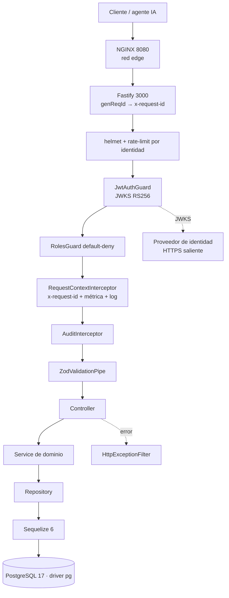
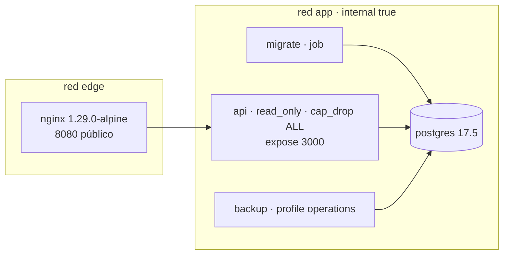

# 00 — Auditoría del estado actual (previa a la trazabilidad distribuida)

> Fase 0 del plan de observabilidad. Documenta la arquitectura **real** verificada en el
> repositorio antes de introducir OpenTelemetry. Ninguna afirmación de este documento es
> supuesta: cada una cita el archivo que la sostiene.

Fecha de la auditoría: 2026-08-03 · Rama: `main` · Estado del árbol: cambios de hardening sin
confirmar (no relacionados con esta iniciativa).

---

## 1. Arquitectura detectada

| Aspecto | Valor real | Evidencia |
|---|---|---|
| Framework | NestJS 11.1.28 | `package.json` |
| Adaptador HTTP | **Fastify 5.10.0** (`@nestjs/platform-fastify`). Express prohibido por ADR 0001 y gate `quality:architecture` | `src/main.ts:38`, `.claude/rules/10-backend-architecture.md` |
| Lenguaje | TypeScript 5.8.3, `strict`, `exactOptionalPropertyTypes`, `noUncheckedIndexedAccess`, `module: commonjs`, `target: ES2022` | `tsconfig.json` |
| Node | `>=20.19 <21 \|\| >=22 <23`; imagen runtime `node:22.16.0-bookworm-slim` | `package.json`, `Dockerfile` |
| Gestor de paquetes | **Yarn 1.22.22** (`packageManager`) | `package.json` |
| ORM | Sequelize 6.37.8 + `sequelize-typescript` 2.1.6 | `package.json` |
| Driver PostgreSQL | **`pg` 8.16.3** (driver real que ejecuta toda consulta) | `package.json` |
| Base de datos | PostgreSQL 17.5 (`postgres:17.5-alpine`) | `docker-compose.yml` |
| Logs | Pino 9.9.5 vía `nestjs-pino` 4.6.1, JSON a stdout, `autoLogging: false` | `src/app.module.ts:36-63` |
| Métricas | `prom-client` 15.1.3, registro propio, endpoint `/metrics` protegido por token | `src/common/observability/metrics.service.ts`, `src/modules/health/health.controller.ts` |
| Validación | Zod 4.4.3 en el borde | `src/common/validation/zod-validation.pipe.ts` |
| AuthN/AuthZ | JWT RS256 por JWKS (`jsonwebtoken` + `jwks-rsa`) y RBAC default-deny | `src/common/auth/jwt-auth.guard.ts`, `roles.guard.ts` |

### 1.1 Tecnologías del enunciado que **no existen** en este repositorio

Se verificó su ausencia; no se instrumentan y **no deben introducirse**:

| Tecnología | Estado | Motivo |
|---|---|---|
| Redis | **Ausente** | No figura en `package.json`. `.claude/rules/50-performance.md` exige ADR para introducirlo |
| Colas (Bull/BullMQ/pg-boss/amqplib/kafkajs) | **Prohibidas** | ADR 0003 «Sin cola en la primera versión». El gate `yarn quality:async-scope` falla si aparece cualquiera de esas dependencias |
| Workers independientes | **Prohibidos** | El mismo gate falla si existe **cualquier archivo en `src/` cuyo nombre contenga `worker`** (`scripts/validate_async_scope.py:18-20`) |
| Axios / `@nestjs/axios` / HttpModule | Ausente | No hay cliente HTTP saliente de negocio |
| WebSockets | Ausente | Sin `@nestjs/websockets` |
| GraphQL | Ausente | La API es REST + OpenAPI (ADR 0008) |
| Microservicios Nest | Ausente | Monolito modular |
| `@nestjs/schedule` | Ausente | La periodicidad se implementa con `setInterval().unref()` |

**Consecuencia para el plan:** las fases 10 (Redis) y 12 (colas/workers) del enunciado no tienen
sustrato real. Se resuelven con un punto de extensión probado y documentado, no con dependencias
nuevas (ver §6).

---

## 2. Procesos ejecutables y punto exacto de arranque

Existen **cuatro** clases de proceso; sólo una es un servidor de larga vida.

| Proceso | Comando | Entrada | Larga vida |
|---|---|---|---|
| **API** | `node dist/main.js` (`yarn start`) / `nest start --watch` (`yarn dev`) | `src/main.ts` → `bootstrap()` | Sí |
| Migrador | `node dist/database/cli/migrate.js` (servicio `migrate` de Compose) | `src/database/cli/migrate.ts` | No (job) |
| Semillas | `yarn db:seed:boot` / `db:seed:mock` | `src/database/seeds/runners/*.ts` | No (job) |
| Utilidades | `yarn openapi:export`, `yarn smoke`, `yarn soak` | `scripts/*.ts` | No |

- **API y "workers" NO arrancan por separado**: no hay workers. El único trabajo periódico
  in-process es `DomainMetricsCollector` (`setInterval` de 60 s con `unref`,
  `src/common/observability/domain-metrics.collector.ts:43-45`) y `DatabasePoolMetricsCollector`.
- El proceso API no ejecuta backups ni tareas programadas externas
  (`.env.example:51` lo dice explícitamente).
- Apagado: `application.enableShutdownHooks(['SIGINT','SIGTERM'])` (`src/main.ts:55`) y cierre de
  pools en `DatabaseLifecycle.onApplicationShutdown` (`src/database/database.module.ts:10-17`).
  **No hay handlers `process.on('SIGTERM')` propios**: Nest es el único que escucha las señales.

### 2.1 Orden de arranque actual (`src/main.ts`)

```
import 'dotenv/config'        ← 1.ª importación efectiva
import 'reflect-metadata'
import @fastify/helmet, @fastify/rate-limit, @nestjs/*, node:crypto, nestjs-pino
import ./app.module            ← arrastra Sequelize, pg, prom-client, zod, jsonwebtoken
```

`getEnvironment()` (`src/config/environment.ts`) valida `process.env` con Zod **una sola vez** y
cachea el resultado congelado; se invoca tanto desde `main.ts` como desde `app.module.ts` a nivel
de módulo. Es el único punto de lectura de entorno.

---

## 3. Flujo actual de una solicitud



Puntos verificados del flujo:

- `genReqId` normaliza `x-request-id` del cliente con allowlist y longitud máxima
  (`src/common/http/request-id.ts`), y `RequestContextInterceptor` lo devuelve en **toda** respuesta.
- El `HttpExceptionFilter` es global (`APP_FILTER`) y **captura todo** (`@Catch()`), incluidos
  errores de plugins Fastify con `statusCode` numérico.
- La única salida HTTP del proceso es la descarga del JWKS (`jwks-rsa`, `src/common/auth/jwt-auth.guard.ts:36-44`).

---

## 4. Correlación existente y su límite

| Capacidad | Estado hoy |
|---|---|
| Request ID | **Sí** — generado por Fastify, devuelto en `x-request-id`, presente en logs y en el cuerpo de error (`requestId`) |
| Propagación de contexto entre capas | **No** — el `requestId` viaja porque cada capa recibe el objeto `request`; los services y repositories no lo ven |
| Propagación entre procesos | **No existe** |
| Correlación log ↔ traza | **No existe**: no hay trazas |
| Duración por dependencia | Sólo agregada en métricas (`observatory_database_operation_duration_seconds`), sin desglose por consulta |

**Brecha que justifica esta iniciativa:** hoy se puede responder «¿cuántas solicitudes fallaron?»
pero no «¿en qué consulta se fue el tiempo de *esta* solicitud?».

---

## 5. Datos sensibles y superficies de riesgo

Ya redactados por Pino (`src/app.module.ts:39-49`): `req.headers.authorization`,
`req.headers.cookie`, `res.headers["set-cookie"]`, `*.password`, `*.token` (y un nivel anidado).
La URL se registra sin query string (`src/app.module.ts:58`, `http-exception.filter.ts:140`).

Superficies que **la instrumentación automática podría exponer** y que hay que cerrar:

| Riesgo | Origen | Mitigación exigida |
|---|---|---|
| Cabecera `Authorization` en atributos de span | `instrumentation-http` captura cabeceras si se le configura | No configurar captura de cabeceras; nunca `headersToSpanAttributes` |
| Valores de parámetros SQL | `instrumentation-pg` puede añadir `db.statement.parameters` | Mantener `enhancedDatabaseReporting: false` (por defecto) |
| Query string con filtros sensibles | `http.target` / `url.query` | Redactar la query string en un hook de span |
| Tokens en la URI del JWKS | span HTTP saliente | La URI del JWKS no lleva credenciales; se verifica en el diseño |
| Cuerpos de solicitud/respuesta | Ninguna instrumentación los captura por defecto | Prohibido activarlo |
| Cadena de conexión PostgreSQL | Atributos `db.*` | `instrumentation-pg` no expone contraseña; se verifica en pruebas |

Contenido no confiable adicional: la capa de inteligencia recibe texto de agentes de IA
(`src/modules/intelligence/untrusted-content.ts`). **Ese texto nunca debe convertirse en atributo
ni en nombre de span.**

---

## 6. Puntos de instrumentación identificados

| # | Punto | Mecanismo previsto |
|---|---|---|
| 1 | Solicitud HTTP entrante | `@opentelemetry/instrumentation-http` |
| 2 | Ruteo Fastify (ruta normalizada, hooks) | `@fastify/otel` — el paquete de OpenTelemetry para Fastify está deprecado en favor de este |
| 3 | Controller/handler Nest | `@opentelemetry/instrumentation-nestjs-core` |
| 4 | Consulta PostgreSQL | `@opentelemetry/instrumentation-pg` (Sequelize ejecuta a través de `pg`) |
| 5 | Correlación de logs | `@opentelemetry/instrumentation-pino` |
| 6 | HTTP saliente (JWKS) | `@opentelemetry/instrumentation-http` (mismo módulo, lado cliente) |
| 7 | Operaciones de negocio | `TracingService` propio, spans `<dominio>.<acción>` |
| 8 | Errores | `HttpExceptionFilter` → `recordException` sobre el span activo |
| 9 | Cabecera de soporte | `RequestContextInterceptor` → `x-trace-id` |
| 10 | Tarea periódica | `DomainMetricsCollector` → span raíz |
| 11 | Frontera asíncrona futura | `MessagingTraceService` (inyección/extracción W3C sobre carrier genérico) |

**Sequelize:** se instrumenta **a través de `pg`**, no con un paquete específico. Justificación en
`01-architecture-design.md` §5 (evita spans duplicados y una dependencia de tercero fuera del
núcleo oficial de OpenTelemetry).

**Redis y colas:** puntos 11 y siguientes quedan como contrato probado sin dependencia, porque
introducirlas violaría ADR 0003 y el gate `quality:async-scope`.

---

## 7. Endpoints a excluir de la traza

Los tres primeros están fuera del prefijo global (`src/main.ts:56-62`) y son los únicos internos
de monitoreo que existen:

```
/health     liveness   (sondeo cada 20-30 s por Docker y NGINX)
/ready      readiness  (autentica ambos pools)
/metrics    Prometheus (bloqueado en el edge por NGINX)
/favicon.ico
```

`/docs` y `/docs/openapi.json` sólo existen con `SWAGGER_ENABLED=true`, que la validación de
entorno prohíbe en producción; también se excluyen.

---

## 8. Arquitectura de despliegue



- **Un solo servicio publica puertos: `nginx`.** El gate `yarn quality:operations`
  (`scripts/validate_operations.py:36-40`) **falla** si aparece otro servicio con `ports` en
  `docker-compose.yml`.
- La red `app` es `internal: true`: sin salida a Internet desde los contenedores de aplicación.
- El contenedor API es `read_only` con `cap_drop: [ALL]` y `no-new-privileges`.
- Patrón de superposición ya usado por el repositorio: `docker-compose.local.yml` añade puertos
  sólo para desarrollo (`yarn local:db:up`).

---

## 9. Restricciones del repositorio que condicionan el diseño

Verificadas leyendo los validadores; **cualquier entregable debe respetarlas**.

| Restricción | Fuente | Impacto en esta iniciativa |
|---|---|---|
| El código productivo compilado y auditado vive sólo en `src/main.ts`, `src/app.module.ts`, `src/common/**`, `src/config/**`, `src/database/**`, `src/modules/{governance,health,ingestion,intelligence,provenance,quality,query}/**` | `tsconfig.json:24-39`, `scripts/project_scope.py:11-24` | **Un directorio `src/observability/` quedaría fuera de `tsc` y de todos los gates.** La telemetría se ubica en `src/common/observability/` |
| Ningún archivo mantenido ≥ 300 líneas (aviso desde 220) | `scripts/check_file_limits.py` | Archivos pequeños y de responsabilidad única |
| Prohibido `any`, `console.*`, `@ts-ignore`, `catch {}` vacío, marcadores `TODO/FIXME/HACK` | `scripts/check_clean_code.py`, `scripts/validate_project.py:35-36` | Sin excepciones, tampoco en pruebas del scope |
| Prohibidos nombres de archivo/clase genéricos (`utils`, `helpers`, `manager`, `processor`) | `scripts/check_clean_code.py:10-23` | Nombres explícitos |
| Un módulo no importa el interior de otro módulo | `scripts/validate_architecture.py:59-63` | La telemetría se expone desde un módulo `@Global()` de `src/common` |
| Los controllers no importan detalle de persistencia | `scripts/validate_architecture.py:37-44` | Sin cambios en controllers salvo lo imprescindible |
| Dependencias de cola prohibidas; ningún archivo `*worker*` en `src/` | `scripts/validate_async_scope.py` | Sin BullMQ, sin workers |
| `src/main.ts` debe conservar `bodyLimit: environment.BODY_LIMIT_BYTES`, `register(rateLimit`, `origins.length ? origins : false` | `scripts/validate_security_contracts.py` | Editar `main.ts` sin tocar esas expresiones |
| `docker-compose.yml`: sólo `nginx` con `ports` | `scripts/validate_operations.py` | Jaeger va en un archivo de superposición |
| Identificadores en inglés | `scripts/check_identifier_language.cjs` | Código en inglés, documentación en español |
| Toda dependencia nueva exige matriz de evaluación | `.claude/rules/70-library-selection.md` | Matriz en `01-architecture-design.md` |
| `yarn`, nunca npm/pnpm; lockfile consistente | `package.json`, reglas | Instalación con `yarn add` |

### 9.1 Línea base de calidad antes de tocar nada

```
$ yarn typecheck   → Done in 2.65s (sin errores)
$ yarn test        → Test Suites: 28 passed, Tests: 188 passed
```

---

## 10. Plan de implementación adaptado a este repositorio

| Fase | Adaptación real |
|---|---|
| 1 Diseño | ADR + `01-architecture-design.md` con matriz de librerías |
| 2 Dependencias | Instrumentaciones **selectivas** (no `auto-instrumentations-node`), exportador OTLP/HTTP |
| 3 Bootstrap | `src/common/observability/telemetry.bootstrap.ts` como 1.ª importación de `src/main.ts` |
| 4 Instrumentación automática | http, fastify, nestjs-core, pg, pino. Sin `fs`, `dns`, `net` |
| 5 Módulo Nest | Ampliar el `ObservabilityModule` existente (`@Global()`), sin crear un módulo paralelo |
| 6 Logs | `instrumentation-pino` inyecta `trace_id`/`span_id`; Pino no se sustituye ni se duplica |
| 7 Errores | `HttpExceptionFilter` registra la excepción saneada en el span activo |
| 8 Spans de negocio | Operaciones críticas reales de `intelligence`, `ingestion`, `provenance`, `query` |
| 9 PostgreSQL | Vía `pg`; se verifica jerarquía y ausencia de duplicación con Sequelize |
| 10 Redis | **No aplica** — documentado, con el diseño preparado |
| 11 HTTP externo | JWKS, ya cubierto por `instrumentation-http` |
| 12 Colas/workers | **No aplica** — `MessagingTraceService` como contrato probado, sin dependencia |
| 13 Programados | Span raíz en `DomainMetricsCollector` |
| 14 Docker local | `docker-compose.jaeger.yml` como superposición, puertos atados a `127.0.0.1` |
| 15 Collector | `infra/otel-collector/otel-collector.config.yml` |
| 16 Producción | `03-production-topology.md` |
| 17 Muestreo | `parentbased_traceidratio` configurable por entorno |
| 18 Seguridad | `04-data-privacy-policy.md` + hooks de redacción |
| 19-21 Pruebas | Unitarias con `InMemorySpanExporter`; e2e con `app.inject`; script de verificación contra Jaeger |
| 22 Rendimiento | `yarn soak` con y sin telemetría |
| 23-24 Documentación | `README.md` + `06-operational-runbook.md` |
| 25 Revisión | `yarn quality:all`, `lint`, `typecheck`, `test`, `build` |

---

## 11. Archivos que **serán** creados o modificados

### Creados

> Lista prevista en la Fase 0. La implementación real añadió cuatro archivos no anticipados
> —`telemetry.diagnostics.ts`, `telemetry.lifecycle.ts`, `fastify-tracing.plugin.ts` y
> `span-failure.ts`— y no creó `trace-response.interceptor.ts`, porque la cabecera `x-trace-id`
> se emite desde el interceptor de respuesta ya existente en lugar de duplicar uno nuevo.

```
src/common/observability/telemetry.bootstrap.ts
src/common/observability/telemetry.config.ts
src/common/observability/telemetry.constants.ts
src/common/observability/telemetry.diagnostics.ts
src/common/observability/telemetry.instrumentations.ts
src/common/observability/telemetry.lifecycle.ts
src/common/observability/telemetry.redaction.ts
src/common/observability/telemetry.shutdown.ts
src/common/observability/fastify-tracing.plugin.ts
src/common/observability/span-failure.ts
src/common/observability/tracing.service.ts
src/common/observability/trace-context.service.ts
src/common/observability/messaging-trace.service.ts
src/common/observability/tests/*.spec.ts
src/common/errors/tests/http-exception.tracing.spec.ts
src/common/http/tests/request-context.interceptor.spec.ts
docker-compose.jaeger.yml
infra/otel-collector/otel-collector.config.yml
scripts/verify-jaeger.sh
docs/observability/*.md
docs/decisions/0015-distributed-tracing.md
test/observability/tracing.e2e-spec.ts
test/observability/tracing-registry.ts
test/observability/tracing-setup.ts
```

### Modificados

```
package.json / yarn.lock            dependencias y scripts jaeger:*
src/config/environment.ts           variables OTEL_* validadas con Zod
src/main.ts                         1.ª importación = bootstrap de telemetría
src/common/observability/observability.module.ts   nuevos proveedores
src/common/http/request-context.interceptor.ts     cabecera x-trace-id
src/common/errors/http-exception.filter.ts         recordException
src/common/observability/domain-metrics.collector.ts  span raíz programado
servicios de dominio seleccionados  spans de negocio
test/jest-e2e.json                  setupFiles del arranque de trazas en pruebas
.env.example                        variables OTEL_*
docs/decisions/README.md            alta del ADR 0015
docs/decisions/library-matrix.md    filas de trazas y transporte
```

### Archivos que **NO** deben modificarse

```
docker-compose.yml                  rompería quality:operations (un solo servicio con ports)
src/database/migrations/**          migraciones aplicadas son inmutables
src/database/models/**              se generan, no se escriben
src/database/seeds/**               catálogos gobernados
docs/endpoints/openapi.yaml         el contrato no cambia: x-trace-id es cabecera, no cuerpo
src/common/auth/**                  la seguridad no se relaja por observabilidad
infra/nginx/nginx.conf              /metrics sigue bloqueado en el edge
Dockerfile                          sin cambios: la telemetría se activa por variables de entorno
```

---

## 12. Riesgos identificados

| # | Riesgo | Severidad | Mitigación |
|---|---|---|---|
| R1 | Importación tardía del bootstrap deja instrumentaciones sin efecto | Alta | El bootstrap es la primera línea de `src/main.ts`; se verifica con una prueba e2e que exige spans reales |
| R2 | Fuga de datos sensibles a Jaeger | Alta | Sin captura de cabeceras ni cuerpos; redacción de query string; política en `04-data-privacy-policy.md` |
| R3 | Jaeger caído degrada la API | Alta | Exportación por lotes asíncrona; `BatchSpanProcessor` descarta al saturarse; prueba explícita con Jaeger apagado |
| R4 | Spans duplicados pg + Sequelize | Media | No se instala instrumentación de Sequelize; verificación en prueba de integración |
| R5 | Crecimiento de archivos por encima de 299 líneas | Media | Módulos de telemetría pequeños; se ejecuta `quality:files` en cada fase |
| R6 | Doble inicialización del SDK en pruebas | Media | El bootstrap sólo se importa desde `main.ts`; guarda de idempotencia interna |
| R7 | Sobrecarga de latencia | Media | Muestreo configurable; medición con `yarn soak` antes/después |
| R8 | `instrumentation-pino` no cubre logs emitidos fuera de contexto activo | Baja | Documentado en el runbook §«Los logs no tienen trace_id» |
| R9 | Ruptura de un gate de calidad | Media | `yarn quality:all` al cierre de cada fase con impacto en código |
| R10 | Exposición de la UI de Jaeger | Alta en producción | Puertos locales atados a `127.0.0.1`; topología de producción con red privada y autenticación |

---

## 13. Criterio de aceptación de la Fase 0

- [x] Punto de arranque de cada proceso identificado (§2).
- [x] Adaptador HTTP, ORM, driver, logger y sistema de métricas confirmados por archivo (§1).
- [x] Ausencia de Redis, colas y workers verificada, con la regla que lo prohíbe (§1.1).
- [x] Endpoints excluidos enumerados (§7).
- [x] Riesgos y restricciones del repositorio documentados (§9, §12).
- [x] Línea base de calidad ejecutada y registrada (§9.1).

**Estado: completada. Habilita el inicio de la Fase 1.**
