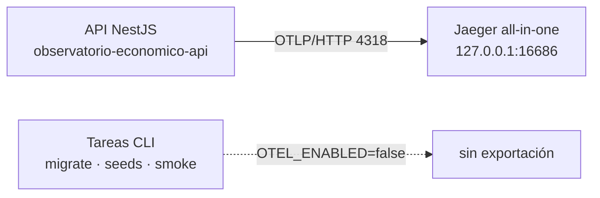
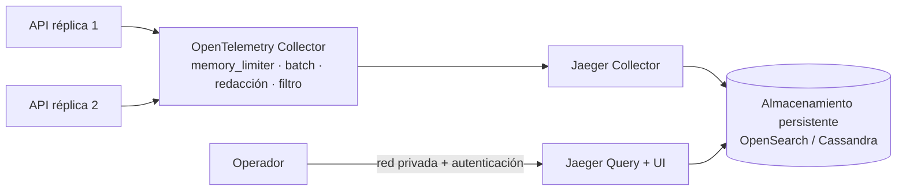

# 01 — Diseño de la arquitectura de observabilidad

> Fase 1. Define **cómo** se integra OpenTelemetry en este backend sin acoplar el dominio a
> Jaeger. Cada decisión lista alternativas, ventajas, riesgos y motivo de selección.
> Decisión formal: `docs/decisions/0015-distributed-tracing.md`.

Punto de partida: `00-current-state-audit.md`.

---

## 1. Principio rector

```mermaid
flowchart LR
    D[Servicios de dominio] -->|inyección Nest| T[TracingService]
    T -->|@opentelemetry/api| SDK[NodeSDK]
    SDK -->|OTLP| J[Jaeger / Collector]
    style D fill:#e8f5e9
    style J fill:#fff3e0
```

El dominio **no importa** `@opentelemetry/*` ni conoce Jaeger: depende de `TracingService`, una
superficie de cuatro métodos. El acoplamiento con OpenTelemetry queda confinado a
`src/common/observability/`. Sustituir Jaeger por Tempo, Zipkin o un Collector distinto es un
cambio de variable de entorno; sustituir OpenTelemetry es un cambio de un directorio.

---

## 2. Topología

### 2.1 Desarrollo



Exportación directa a Jaeger. Sin Collector: una pieza menos que operar en local y el mismo
protocolo que en producción.

### 2.2 Producción recomendada



El Collector es la frontera de control: aplica redacción y filtrado **fuera** del proceso de
negocio, absorbe picos y permite reiniciar Jaeger sin tocar la API. Detalle en
`03-production-topology.md`.

---

## 3. Decisión: protocolo de exportación

| Opción | Ventajas | Riesgos |
|---|---|---|
| **OTLP/HTTP + JSON** (`@opentelemetry/exporter-trace-otlp-http`) | Depurable con `curl` y legible en un `tcpdump`; atraviesa cualquier proxy HTTP/1.1 (el repositorio ya opera NGINX); el destino se cambia con una variable de entorno | Payload ~30 % mayor que protobuf |
| OTLP/HTTP + protobuf (`exporter-trace-otlp-proto`) | Payload compacto | Serialización opaca al depurar; ventaja irrelevante al volumen actual |
| OTLP/gRPC (`exporter-trace-otlp-grpc`) | Mejor rendimiento a gran volumen | Exige HTTP/2 extremo a extremo; la red `app` de Compose es `internal` y NGINX no está configurado para gRPC; complica el diagnóstico en desarrollo |

**Seleccionado: OTLP/HTTP + JSON.** El volumen esperado (una réplica de API, tráfico
institucional) no justifica el coste operativo de gRPC. `OTEL_EXPORTER_OTLP_TRACES_ENDPOINT`
permite apuntar a un Collector sin tocar código; migrar a protobuf o gRPC es cambiar el paquete
exportador dentro de `telemetry.bootstrap.ts`, sin impacto en el dominio.

> **Nota honesta sobre el peso del árbol de dependencias:** `@opentelemetry/sdk-node` arrastra de
> forma transitiva los tres exportadores (JSON, protobuf y gRPC) y `protobufjs`. Elegir el
> exportador JSON **no** reduce el número de paquetes instalados; la elección se sostiene en la
> operabilidad y en la compatibilidad con la infraestructura HTTP existente, no en el tamaño del
> árbol. Evitar `sdk-node` en favor de `sdk-trace-node` + `registerInstrumentations` sí reduciría
> el árbol, a cambio de reimplementar detección de recursos, propagadores y ciclo de apagado; se
> descartó por ser código propio sustituyendo a código mantenido por el proyecto oficial.

---

## 4. Decisión: instrumentaciones selectivas, no `auto-instrumentations-node`

| Opción | Ventajas | Riesgos |
|---|---|---|
| `@opentelemetry/auto-instrumentations-node` | Una línea; cubre todo | Instala ~40 paquetes para tecnologías inexistentes aquí (AWS, MongoDB, Kafka, GraphQL, Redis…). Contradice `.claude/rules/70-library-selection.md` («no agregar paquetes sin uso real») y multiplica la superficie de CVE. Activa `fs` y `dns`, que generan ruido |
| **Instrumentaciones explícitas** | Sólo lo que existe; jerarquía de spans legible; superficie mínima | Requiere añadir un paquete cuando entre una tecnología nueva — que es exactamente el momento de decidirlo |

**Seleccionado: explícitas.**

| Paquete | Cubre | Justificación |
|---|---|---|
| `@opentelemetry/instrumentation-http` | Servidor y cliente HTTP/HTTPS | Solicitud entrante y descarga del JWKS |
| `@fastify/otel` | Ruta normalizada y hooks del ciclo de vida | El adaptador real (ADR 0001). Es el sucesor oficial de `@opentelemetry/instrumentation-fastify`, que el propio paquete declara **deprecado**; adoptar un paquete descontinuado contradiría la regla de no usar librerías abandonadas |
| `@opentelemetry/instrumentation-nestjs-core` | Controller y handler | Responde «¿qué controller la procesó?» |
| `@opentelemetry/instrumentation-pg` | Consultas PostgreSQL | El driver real bajo Sequelize |
| `@opentelemetry/instrumentation-pino` | Inyección de `trace_id`/`span_id` en logs | El logger existente; no se sustituye |

**Descartadas explícitamente:** `fs`, `dns`, `net` (ruido sin valor diagnóstico),
`undici` (no hay `fetch` de negocio; `jwks-rsa` usa el módulo `https`),
`redis`/`ioredis`/`bullmq`/`graphql`/`socket.io` (tecnologías inexistentes y, en el caso de
colas, prohibidas por ADR 0003).

---

## 5. Decisión: Sequelize se instrumenta a través de `pg`

| Opción | Ventajas | Riesgos |
|---|---|---|
| **Sólo `instrumentation-pg`** | Un span por consulta realmente ejecutada, con SQL y duración exactos | El span no dice qué método de Sequelize lo originó |
| `pg` + instrumentación de Sequelize de terceros | Añade una capa ORM | **Spans duplicados** por consulta (lo que el enunciado prohíbe en Fase 9); el paquete queda fuera del núcleo oficial de OpenTelemetry y su mantenimiento no está garantizado; sería una segunda librería para la misma responsabilidad, prohibido sin ADR por `.claude/rules/70-library-selection.md` |

**Seleccionado: sólo `pg`.** La atribución al código de negocio se resuelve con spans propios:
`ReadQueryExecutor` ya recibe un **nombre estable de operación** (`observability.domain_counts`,
`query.execute_plan`, …) que se convierte en el span padre de las consultas. Se obtiene la misma
información sin duplicar spans ni añadir una dependencia de tercero.

---

## 6. Ubicación del código

El enunciado sugiere `src/observability/`. **No es viable aquí**: `tsconfig.json` y
`scripts/project_scope.py` definen el grafo mantenido y no incluyen ese directorio; el código
quedaría fuera de `tsc --noEmit`, de ESLint con tipos y de los 18 validadores.

**Decisión:** todo vive en `src/common/observability/`, junto a las métricas Prometheus, y se
expone por el `ObservabilityModule` ya existente, que es `@Global()`. Ningún módulo de dominio
necesita cambiar sus `imports`, lo que evita romper el gate `quality:architecture`.

```
src/common/observability/
├── observability.module.ts        (modificado) registra los proveedores de trazas
├── telemetry.bootstrap.ts         (nuevo) arranque del NodeSDK y sampler — 1.ª importación del proceso
├── telemetry.config.ts            (nuevo) configuración derivada del entorno validado
├── telemetry.constants.ts         (nuevo) nombres de atributos, tracer y rutas excluidas
├── telemetry.instrumentations.ts  (nuevo) selección y ajuste de instrumentaciones
├── telemetry.redaction.ts         (nuevo) saneamiento de URL y atributos
├── telemetry.diagnostics.ts       (nuevo) diagnóstico interno del SDK como JSON a stderr
├── telemetry.shutdown.ts          (nuevo) registro y cierre idempotente del SDK
├── telemetry.lifecycle.ts         (nuevo) cierre desde OnApplicationShutdown de Nest
├── fastify-tracing.plugin.ts      (nuevo) plugin de Fastify, registrado explícitamente en main.ts
├── span-failure.ts                (nuevo) registro saneado de fallos, compartido
├── tracing.service.ts             (nuevo) API de spans para el dominio
├── trace-context.service.ts       (nuevo) lectura de trace_id/span_id activos
├── messaging-trace.service.ts     (nuevo) inyección/extracción W3C sobre carrier
├── metrics.service.ts             (existente, sin cambios)
├── domain-metrics.collector.ts    (modificado) span raíz programado
└── database-pool.collector.ts     (existente, sin cambios)
```

---

## 7. Identidad del servicio

Convención `<producto>-<componente>`:

| Recurso | Valor por defecto | Variable |
|---|---|---|
| `service.name` | `observatorio-economico-api` | `OTEL_SERVICE_NAME` |
| `service.namespace` | `observatorio-economico` | `OTEL_SERVICE_NAMESPACE` |
| `service.version` | versión de `package.json` | `OTEL_SERVICE_VERSION` |
| `deployment.environment.name` | `NODE_ENV` | `OTEL_DEPLOYMENT_ENVIRONMENT` |
| `service.instance.id` | hostname del proceso | automático |

Nombres reservados para componentes futuros, para que nadie reutilice el de la API:
`observatorio-economico-scheduler`, `observatorio-economico-ingestor`.

---

## 8. Convenciones de nombres

### 8.1 Spans de negocio

```
<dominio>.<acción>            dominio = módulo real del repositorio
```

Ejemplos válidos en este backend: `intelligence.daily-analysis`, `intelligence.submit-claims`,
`ingestion.import-batch`, `provenance.register-artifact`, `query.execute-data-query`,
`scheduler.domain-metrics`.

**Prohibido** incluir identificadores en el nombre: `intelligence.submit-claims.9f3a…` genera
cardinalidad ilimitada y rompe la agregación en Jaeger. El identificador va como atributo.

### 8.2 Atributos propios

Namespace `app.*`, todos de **baja cardinalidad** salvo los identificadores explícitos, que son
UUID internos sin significado personal:

| Atributo | Tipo | Ejemplo |
|---|---|---|
| `app.module` | enum corto | `intelligence` |
| `app.operation` | enum corto | `submit-claims` |
| `app.entity.type` | enum corto | `agent-run` |
| `app.entity.id` | UUID interno | `0f5c…` |
| `app.organization.id` | UUID interno | `…` |
| `app.batch.size` | entero | `42` |
| `app.job.name` | enum corto | `domain-metrics` |
| `app.job.attempt` | entero | `1` |

`app.entity.id` y `app.organization.id` son claves técnicas internas, nunca identificadores
personales ni documentos. Ver `04-data-privacy-policy.md`.

### 8.3 Atributos prohibidos

Cabeceras (`Authorization`, `Cookie`), cuerpos, query strings sin redactar, texto producido por
agentes de IA (`assertion`, `excerpt`, `rawPayload`), valores de parámetros SQL, cadenas de
conexión, variables de entorno y cualquier secreto.

---

## 9. Propagación

| Aspecto | Decisión |
|---|---|
| Propagadores | `tracecontext` + `baggage` (W3C), configurables por `OTEL_PROPAGATORS` |
| B3 | **No** — no existe sistema heredado que lo requiera; añadirlo sería superficie sin uso |
| Origen del `trace_id` | Exclusivamente el contexto activo de OpenTelemetry. **Nunca** un valor enviado por el cliente: `x-request-id` sigue siendo la correlación de negocio y no se convierte en `trace_id` |
| Relación con `x-request-id` | Coexisten. `x-request-id` identifica la petición para auditoría; `x-trace-id` identifica la traza para diagnóstico. Ambos aparecen en el log de cierre |
| Frontera asíncrona | `MessagingTraceService` inyecta/extrae un carrier `Record<string,string>`. Sin consumidor hoy (ADR 0003); es el contrato que usará el primer proceso diferido aprobado |

---

## 10. Muestreo

`parentbased_traceidratio`: respeta la decisión del servicio que origina la traza y aplica un
ratio propio sólo en trazas raíz.

| Entorno | Ratio inicial | Motivo |
|---|---|---|
| development | 1.0 | Volumen despreciable; se necesita ver todo |
| test | 0.0 con exportador en memoria | Las pruebas no exportan a la red |
| staging | 0.25 – 1.0 | Según tráfico de validación |
| production | 0.05 – 0.20 | Punto de partida a ajustar con tráfico real, no un valor definitivo |

Configurable por `OTEL_TRACES_SAMPLER` / `OTEL_TRACES_SAMPLER_ARG`; sin porcentaje escrito en
código. Cuando se requiera conservar el 100 % de errores y colas lentas, se implementa
*tail sampling* en el Collector, no en la aplicación (detalle en `03-production-topology.md`).

---

## 11. Exclusiones

Trazas suprimidas en el origen (no llegan al exportador):

```
/health   /ready   /metrics   /favicon.ico   /docs   /docs/openapi.json
```

Motivo: son sondeos cada 20–30 s de Docker y NGINX; a ratio 1.0 dominarían el almacenamiento sin
aportar diagnóstico. La supresión se aplica con `ignoreIncomingRequestHook`, de modo que tampoco
se paga el coste de crear el span.

---

## 12. Política de errores

1. La instrumentación HTTP fija el estado del span a partir del código de respuesta.
2. `HttpExceptionFilter` **registra la excepción** en el span activo: la instrumentación no puede
   verla porque el filtro la convierte en respuesta.
3. Sólo se registra una vez y sólo para respuestas ≥ 500 o errores no controlados; un 400 de
   validación es un resultado esperado, no un fallo del servidor.
4. El texto registrado pasa por `toSafeErrorLog`, que ya elimina SQL, valores ligados y
   secretos.
5. El filtro **no** cierra spans que no creó, no altera códigos HTTP y no cambia el cuerpo.

---

## 13. Estrategia de cierre

El proceso ya declara `enableShutdownHooks(['SIGINT','SIGTERM'])`, de modo que Nest es el único
que escucha señales. Añadir un `process.on('SIGTERM')` propio competiría con él.

**Decisión:** un proveedor `TelemetryLifecycle implements OnApplicationShutdown` en el
`ObservabilityModule` ejecuta `shutdownTelemetry()` **después** de que Nest cierre controllers y
pools. Garantiza que los spans del apagado se exporten y que ninguna exportación quede pendiente.
El módulo de observabilidad nunca llama a `process.exit`.

---

## 14. Estrategia de logs

`@opentelemetry/instrumentation-pino` inyecta `trace_id`, `span_id` y `trace_flags` en cada
registro emitido dentro de un contexto activo. Pino, `nestjs-pino`, la redacción y los
serializadores existentes **no cambian**. No se añade middleware ni se duplica ningún log.

**No se añade `traceId` manualmente a ningún log**: la instrumentación ya lo inyecta en todo
registro emitido dentro del contexto activo, y duplicar el campo sólo generaría dos nombres para
el mismo dato. Lo que sí se añade es la cabecera `x-trace-id` en la respuesta, leída del contexto
activo en `RequestContextInterceptor`.

---

## 15. Estrategia ante datos sensibles

Tres barreras, de la más cercana al dato a la más lejana:

1. **No capturar**: sin `headersToSpanAttributes`, sin `enhancedDatabaseReporting`, sin cuerpos.
2. **Redactar en el proceso**: hook de span que reemplaza la query string por `?<redacted>` y
   elimina credenciales embebidas en URL.
3. **Redactar en el Collector** (producción): procesador `attributes` que borra o hashea lo que
   se escape de las dos primeras.

Política completa y procedimiento ante filtración: `04-data-privacy-policy.md`.

---

## 16. Estrategia para tecnologías ausentes

| Tecnología | Estrategia |
|---|---|
| Redis | No se instala nada. Si un ADR la aprueba: añadir `@opentelemetry/instrumentation-ioredis` en `telemetry.instrumentations.ts` y spans `cache.lookup` / `cache.invalidate` con `TracingService`. Sin cambios en el resto del diseño |
| Colas y workers | ADR 0003 las prohíbe y `quality:async-scope` falla ante un archivo `*worker*`. El contrato de propagación (`MessagingTraceService`) queda implementado y probado para que el primer proceso diferido aprobado no tenga que rediseñarlo |
| WebSockets, GraphQL, microservicios | Sin sustrato. Se añadirían como instrumentaciones adicionales en el mismo punto |

---

## 17. Contrato del `TracingService`

```ts
runInSpan<T>(name, attributes, operation): Promise<T>   // span interno, cierra en finally
runInRootSpan<T>(name, attributes, operation): Promise<T> // traza nueva para trabajo programado
addEvent(name, attributes?): void
setAttributes(attributes): void
recordException(error): void
```

Reglas: el span siempre se cierra en `finally`; ante error se marca `SpanStatusCode.ERROR`, se
registra la excepción y **se relanza el error original sin envolverlo**; soporta operaciones
síncronas y asíncronas conservando el tipo genérico.

---

## 18. Variables de entorno

Todas se validan en `src/config/environment.ts` con Zod, junto al resto de la configuración. No
se lee `process.env` de forma dispersa: `telemetry.config.ts` recibe el entorno ya validado.

| Variable | Por defecto | Efecto |
|---|---|---|
| `OTEL_ENABLED` | `false` | `false` ⇒ no se crea el SDK; la API arranca igual y los spans son no-op |
| `OTEL_SERVICE_NAME` | `observatorio-economico-api` | `service.name` |
| `OTEL_SERVICE_NAMESPACE` | `observatorio-economico` | `service.namespace` |
| `OTEL_SERVICE_VERSION` | `1.0.0` | `service.version` |
| `OTEL_DEPLOYMENT_ENVIRONMENT` | valor de `NODE_ENV` | `deployment.environment.name` |
| `OTEL_EXPORTER_OTLP_TRACES_ENDPOINT` | `http://localhost:4318/v1/traces` | Destino OTLP |
| `OTEL_EXPORT_TIMEOUT_MS` | `10000` | Timeout de exportación |
| `OTEL_TRACES_SAMPLER` | `parentbased_traceidratio` | Estrategia |
| `OTEL_TRACES_SAMPLER_ARG` | `1` | Ratio (0–1) |
| `OTEL_PROPAGATORS` | `tracecontext,baggage` | Propagadores |
| `OTEL_DIAG_LOG_LEVEL` | `ERROR` | Diagnóstico interno del SDK |

`OTEL_ENABLED` es `false` por defecto **a propósito**: ningún proceso existente (migraciones,
semillas, exportación de contrato, pruebas) cambia de comportamiento hasta que alguien lo active.

---

## 19. Criterio de aceptación de la Fase 1

- [x] Protocolo, exportador y endpoint decididos con alternativas evaluadas (§3).
- [x] Instrumentaciones seleccionadas y descartes justificados (§4, §5).
- [x] Ubicación compatible con el grafo mantenido del repositorio (§6).
- [x] Convenciones de nombres y atributos definidas (§7, §8).
- [x] Propagación, muestreo, exclusiones, errores, cierre, logs y privacidad definidos (§9–§15).
- [x] Estrategia para tecnologías ausentes sin introducir dependencias prohibidas (§16).
- [x] Variables centralizadas en la configuración validada (§18).

**Estado: completada.**
