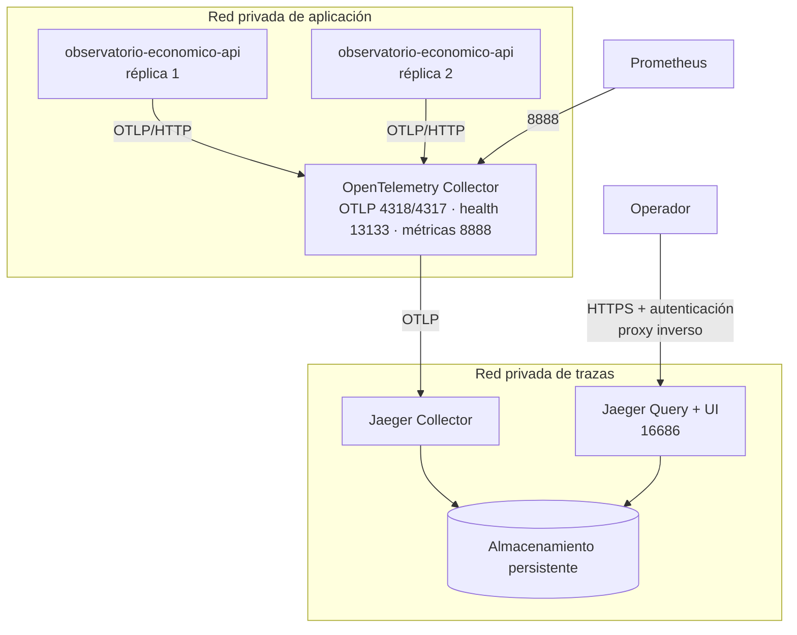

# 03 — Topología de producción

> Fase 16. El modo `all-in-one` con almacenamiento en memoria que usa
> `docker-compose.jaeger.yml` es **exclusivamente para desarrollo**: pierde todas las trazas al
> reiniciar y no tiene autenticación. Este documento define qué hace falta para operarlo de verdad.

Estado: **diseño aprobado, despliegue no ejecutado.** No existe todavía una plataforma de
staging/producción donde aplicarlo; cuando exista, este documento es el plan y su ejecución debe
dejar evidencia en `docs/runbooks/evidence/`.

---

## 1. Topología

Separar Collector y Jaeger no es ceremonia: es lo que permite reiniciar o actualizar Jaeger sin que
la API note nada, porque el Collector mantiene la cola.

## 2. Componentes y puertos

| Componente | Puerto | Expuesto a | Nota |
|---|---|---|---|
| API | 3000 | NGINX (red interna) | Sin cambios respecto a hoy |
| Collector — OTLP/HTTP | 4318 | Sólo red de aplicación | Receptor de las réplicas |
| Collector — OTLP/gRPC | 4317 | Sólo red de aplicación | No usado hoy; disponible |
| Collector — health | 13133 | Orquestador | Sonda de vida |
| Collector — métricas | 8888 | Prometheus | Vigila la cola y los descartes |
| Jaeger Collector | 4317 | Sólo desde el Collector | |
| Jaeger Query/UI | 16686 | Proxy inverso autenticado | **Nunca** público |
| Almacenamiento | según motor | Sólo Jaeger | Red aislada |

**Ningún componente de trazas se publica en Internet.** El endpoint OTLP tampoco: exponerlo
permitiría a cualquiera inyectar trazas falsas o saturar el almacenamiento.

## 3. Almacenamiento

Elección condicionada a la infraestructura ya operada. Hoy la organización opera **PostgreSQL** y
nada más; introducir un clúster nuevo sólo para trazas es una decisión con coste operativo real.

| Opción | Ventajas | Coste / riesgo | Cuándo |
|---|---|---|---|
| **Badger (disco local)** | Sin servicio nuevo; persistente; suficiente para una instancia | Sin alta disponibilidad; ligado al nodo | **Punto de partida recomendado** mientras haya una sola instancia de Jaeger y < ~20 GB de trazas |
| OpenSearch / Elasticsearch | Búsqueda madura, HA, retención por índice | Un clúster nuevo que operar, respaldar y parchear | Cuando haya varias instancias de Jaeger o se supere la capacidad de un disco |
| Cassandra | Escritura a gran escala | La mayor complejidad operativa de las tres | Volúmenes que este observatorio no tiene |

**Decisión:** empezar con **Badger sobre volumen persistente**, y migrar a OpenSearch únicamente
cuando se cumpla al menos uno de estos umbrales medidos:

- más de una instancia de Jaeger Query por disponibilidad;
- volumen sostenido por encima de 20 GB con la retención vigente;
- necesidad de búsquedas por atributo sobre ventanas mayores a la retención.

No desplegar un motor nuevo sin registrar volumen, retención, coste y plan de respaldo.

## 4. Retención

| Entorno | Retención | Motivo |
|---|---|---|
| Staging | 7 días | Validación funcional; no es archivo |
| Producción | **14 días** | Cubre el diagnóstico de un incidente y el análisis posterior sin acumular datos |

La retención se aplica en Jaeger (`--badger.span-store-ttl` o TTL/ILM del motor elegido) y se
verifica midiendo el tamaño del volumen, no asumiéndolo. El registro histórico e inmutable del
sistema es la auditoría en PostgreSQL, no las trazas (`04-data-privacy-policy.md` §5).

## 5. Seguridad

| Control | Aplicación |
|---|---|
| Red privada | Collector, Jaeger y almacenamiento sin ruta pública |
| TLS | Obligatorio entre Collector y Jaeger (`tls.insecure: false` en la configuración) y en el proxy hacia la UI |
| Autenticación de la UI | Proxy inverso con autenticación; Jaeger no la trae |
| Redacción | Barrera 3 en el Collector, además de las dos del proceso |
| Límite de memoria | `memory_limiter` como primer procesador |
| Sin escritura desde fuera | El receptor OTLP no acepta tráfico ajeno a la red de aplicación |
| Imágenes fijadas | Nunca `latest`; versión explícita y escaneada |

## 6. Escalabilidad y disponibilidad

- **Collector**: sin estado salvo su cola en memoria; escala horizontalmente detrás de un balanceo
  L4. Con una sola réplica de API no hace falta más de una instancia.
- **Jaeger Collector**: escala horizontalmente; el cuello real es el almacenamiento.
- **Jaeger Query**: sólo lectura; una instancia basta para un equipo de operación.
- **Presión**: si el almacenamiento se degrada, la cola del Collector se llena y descarta. El
  contrato es explícito: **se pierden trazas, nunca se degrada una petición de negocio.**

## 7. Recuperación

| Fallo | Efecto | Acción |
|---|---|---|
| Collector caído | La API encola en memoria y descarta al llenarse; las peticiones siguen | Reiniciar; `06-operational-runbook.md` §1 |
| Jaeger Collector caído | El Collector reintenta hasta 300 s y luego descarta | Reiniciar; sin impacto en la API |
| Almacenamiento caído | Sin ingestión ni consulta de trazas | Restaurar el volumen; las trazas del periodo se pierden |
| Almacenamiento lleno | Descarte de escrituras | Reducir la retención y dimensionar el volumen |
| Fuga de datos sensibles | Ver `04-data-privacy-policy.md` §7 | Contener, borrar índice, rotar credenciales |

**Las trazas no se respaldan.** Con una retención de 14 días, restaurar un respaldo de trazas no
aporta valor operativo y sí amplía la superficie de datos sensibles conservados.

## 8. Coste operativo (cualitativo)

| Concepto | Con Badger | Con OpenSearch |
|---|---|---|
| Servicios nuevos que operar | 2 (Collector, Jaeger) | 3+ (además el clúster) |
| Almacenamiento | Un volumen persistente | Clúster con réplicas |
| Parcheo y actualizaciones | Dos imágenes | Dos imágenes + clúster con ventanas de mantenimiento |
| Conocimiento requerido | Bajo | Medio-alto |
| Coste de infraestructura | Bajo | Medio |

## 9. Lista de verificación previa al despliegue

- [ ] Imágenes fijadas por versión, escaneadas y aprobadas.
- [ ] `OTEL_EXPORTER_OTLP_TRACES_ENDPOINT` apunta al **Collector**, nunca a Jaeger.
- [ ] `OTEL_TRACES_SAMPLER_ARG` fijado según §17 del diseño y revisable sin desplegar código.
- [ ] `DEPLOYMENT_ENVIRONMENT` y `JAEGER_COLLECTOR_ENDPOINT` definidos para el Collector.
- [ ] Configuración del Collector validada (`validate --config=...`).
- [ ] TLS activo entre Collector y Jaeger.
- [ ] UI detrás de autenticación; sin ruta pública.
- [ ] Retención configurada y verificada midiendo el volumen.
- [ ] Prometheus recoge las métricas del Collector (cola y descartes).
- [ ] Prueba de caída: apagar Jaeger y comprobar que la API sigue respondiendo.
- [ ] Evidencia firmada en `docs/runbooks/evidence/`.
