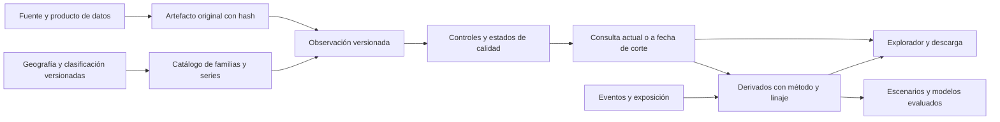

# Arquitectura e implementación de las variables exógenas

Este documento convierte el [plan maestro](PLAN_MAESTRO.md) en una propuesta de trabajo para el backend NestJS y PostgreSQL y el dashboard existentes. Describe cambios futuros; no se han modificado esquemas, recolectores, APIs ni componentes de producción en esta tarea. Los nombres de entidades, rutas y archivos nuevos son propuestas, sujetos a las convenciones del repositorio.

## Principios de integración

1. Reutilizar `provenance`, `governance`, `ingestion`, `quality`, `query` e `intelligence` antes de crear capacidades equivalentes. El README del backend ya describe versiones, procedencia y consulta a fecha de corte; se debe confirmar su comportamiento con los nuevos casos de uso.
2. Mantener compatibilidad con la vista y API de precios mientras se implementa una lectura más general. No renombrar códigos `EXO_*` existentes para acomodar la taxonomía.
3. Separar identidad económica de presentación. Un factor puede afectar muchos sectores y tener muchos mercados; no duplicar su serie para cada pestaña.
4. Mantener inmutables los originales y sus revisiones. Las transformaciones tendrán versiones y linaje hacia sus entradas.
5. Registrar disponibilidad y período observado por separado. Un dato válido para septiembre publicado en noviembre no estuvo disponible para una decisión de octubre.
6. Los eventos, pronósticos y geometrías tienen contratos propios; no se fuerzan a una cifra de precio.

## Mapa de componentes actuales y cambios propuestos

| Archivo o capacidad actual | Cambio futuro | Compatibilidad y control |
| --- | --- | --- |
| `scripts/exogenous/exogenous-spec.ts` | Extraer un contrato general de familia, serie, referencia y fuente | Adaptador del contrato antiguo; conservar códigos existentes |
| `scripts/exogenous/exogenous-sources*.ts` | Registrar identificadores de producto de datos, versión, frecuencia nativa y estado de validación | Revisar metadatos existentes antes de migrar |
| `scripts/exogenous/collect-exogenous-prices.ts` | Conservar conector de precios y reutilizar utilidades de reintento, calendario y evidencia | No convertir el archivo en un recolector monolítico multisectorial |
| `scripts/markets/collect-currency-rates.ts` | Referenciar sus datos desde el catálogo transversal | Mantener mercado, convención monetaria y procedencia por observación |
| `src/database/seeds/schemas/exogenous-prices.schema.ts` | Mantener compatibilidad y añadir contratos versionados para otras mediciones | No elevar topes sin cambiar estrategia de almacenamiento y paginación |
| `src/database/seeds/runners/boot-seed.exogenous-prices.ts` | Mantener la migración de semillas actuales y diseñar lotes incrementales | Prueba de idempotencia y revisiones sobre muestras |
| `src/database/migration-sql/0086-read-the-exogenous-prices.view.ts` | Nueva lectura multidimensional y de versiones disponible por fecha de corte | La vista existente sigue siendo la lectura compatible de precios actuales |
| `observatorio-dashboard/src/lib/exogenous.ts` | Consulta filtrada y paginada con calidad y fecha por serie | Evitar descargar toda la historia de todo el catálogo al abrir el panel |
| `src/lib/exogenous-board.ts` del dashboard | Tipos de frecuencia/unidad y transformaciones específicas por medición | Diferencias de tasas, bases comunes y calendario explícito |
| `src/lib/exogenous-freight.ts` del dashboard | Registrar definición del derivado y sus entradas; evaluar traslado a capa común de consulta | Conciliar sus resultados antes y después de cualquier traslado |
| `src/components/exogenous-explorer.tsx` | Filtros por pregunta, sector, mecanismo, territorio, frecuencia y calidad | Mantener acceso a la navegación por producto ya utilizada |
| `src/components/exogenous-table.tsx` | Mostrar unidad, período, publicación, revisión, rol y estado de datos | Exportación coherente con la tabla y la descarga |
| `src/app/api/exogenas/route.ts` del dashboard | Mantener respuesta compatible y añadir ruta versionada o filtros nuevos | Pruebas de contrato; no cambiar silenciosamente la forma de respuesta |
| `src/lib/asistente/alcance.ts` y `paquetes.ts` | Expandir selección temática y respuestas por mecanismos | Citar período y fuente; declarar proxies y rezagos hipotéticos |
| `.github/workflows/daily-source-batches.yml` | Planificación por calendario y fuente; artefactos incrementales | No disparar todos los conectores cada vez que uno cambia |

Las rutas abreviadas del dashboard se refieren a `observatorio-dashboard`. Antes de numerar migraciones nuevas, revisar el orden real disponible; este plan no reserva números.

## Modelo conceptual



La clasificación sectorial y el papel en un modelo deben ser relaciones, no atributos rígidos de una observación. El crédito de un banco es un resultado del sector financiero y puede ser un condicionante para una empresa prestataria; ambas interpretaciones deben coexistir con objetivo explícito.

| Entidad lógica | Campos principales | Regla |
| --- | --- | --- |
| Familia de variables | ID, concepto, definición, decisiones, responsable | Una familia candidata puede no tener serie observada |
| Serie | ID estable, familia, fuente, medida, unidad, dimensiones, frecuencia nativa, método | Un cambio económico sustantivo de definición exige nueva serie o versión explícita |
| Producto de fuente | Productor, distribuidor, URL de documentación, acceso, licencia, calendario | Una institución puede publicar productos con permisos y frecuencias distintos |
| Dimensiones | País, territorio, sector y versión, producto y clasificación, moneda, mercado, calidad, contrato | Clave canónica de combinación; no introducir nombres libres como única identidad |
| Observación | Serie, período inicial/final, valor decimal, estado, publicación, adquisición, versión | Unicidad con dimensiones y revisión; conservar nulos justificados |
| Evento | Tipo, ocurrencia, anuncio, vigencia, fin, territorio, evidencia, estado de revisión | Puede carecer de intensidad numérica; no asignar un puntaje sin método |
| Exposición | Unidad afectada, factor, peso, referencia temporal, método, cobertura | Los pesos usados para predicción deben estar disponibles en la fecha de corte |
| Transformación | Entradas, método, parámetros, código/versión, fecha y salida | Reproducible; no reemplaza el dato original |
| Relación analítica | Factor, resultado, canal, signo esperado, rezago, evidencia, incertidumbre | No implica causalidad demostrada |
| Pronóstico | Modelo, versión, fecha de emisión, horizonte, valor, intervalo y escenario | Distinguir fecha de emisión de período pronosticado |

## Contrato mínimo de una serie validada

Además de los campos del CSV de investigación, una serie lista para publicación necesita los siguientes datos:

| Bloque | Campos obligatorios propuestos |
| --- | --- |
| Identidad | `series_id`, `family_id`, `definition_version`, `title`, `definition`, `owner` |
| Medición | `measure_type`, `unit_code`, `scale`, `currency`, `price_basis`, `index_base`, `seasonal_adjustment` según corresponda |
| Dimensiones | `geo_id`, `geo_level`, `geo_version`, `sector_code`, `classification_version`, `product_code`, `product_classification_version`, `market`, `grade` según el caso |
| Tiempo | `native_frequency`, `calendar`, `period_semantics`, `release_rule`, `expected_delay`, `freshness_tolerance` |
| Procedencia | `producer`, `distributor`, `source_product_id`, `source_series_key`, `documentation_url`, `license_status` |
| Uso | `analytic_roles`, `target_scope`, `decisions`, `channel`, `lag_hypothesis`, `limitations` |
| Estado | `acquisition_status`, `publication_status`, `coverage_start`, `coverage_end`, `known_breaks`, `last_success` |

Separar además dimensiones que pueden coexistir: `spatial_support` (punto, área, malla, red), `observation_status` (observado, estimado, pronosticado), `measurement_status` (directo o proxy), `transformation_type` (original, anomalía, agregado, índice derivado) y `analytic_role` respecto a `target_scope`. Por ejemplo, una precipitación pronosticada es una medida física con soporte espacial y estado pronosticado; no debe elegir sólo uno de esos atributos. Un derivado puede seguir siendo externo respecto de un objetivo, y un proxy puede medir un resultado endógeno.

Los roles descriptivos de los tres anexos se preservan. El `rol_filtro` del CSV armoniza categorías inequívocas y marca como pendientes los papeles mixtos de producción. La ficha validada necesitará separar series concretas y asignar su papel para cada resultado y horizonte; no transformar el filtro provisional en una afirmación causal.

Ejemplo conceptual, sin valores inventados ni un endpoint supuesto:

```json
{
  "family_id": "CLIMATE_PRECIP_ANOMALY",
  "title": "Anomalía de precipitación en área productiva",
  "measure_type": "PHYSICAL_MEASURE",
  "transformation_type": "ANOMALY",
  "spatial_support": "AREA",
  "observation_status": "ESTIMATED",
  "unit_code": "mm",
  "native_frequency": "MONTHLY",
  "geo_level": "PRODUCTION_AREA",
  "method": "Precipitación agregada menos climatología del mismo mes",
  "required_parameters": ["dataset_version", "climatology_period", "area_weights", "valid_pixel_coverage"],
  "analytic_roles": ["EXTERNAL_DRIVER"],
  "target_scope": "Rendimiento agrícola de una campaña y área definidas",
  "acquisition_status": "RESEARCH",
  "limitations": "La precipitación no mide por sí sola rendimiento ni pérdidas económicas"
}
```

Este ejemplo ilustra campos y no es un registro publicable: faltan identificador de producto, territorio concreto, muestra y validación.

## Tipos de medición y operaciones válidas

La tabla resume reglas por medida y por atributos adicionales. No constituye un único enum: “espacial” y “pronóstico” se guardan en dimensiones independientes de precio, tasa, stock o cantidad.

| Tipo | Ejemplos | Agregación habitual que debe validarse | Operaciones que se deben evitar |
| --- | --- | --- | --- |
| Precio | USD/t, Bs/kg | Media ponderada por volumen compatible o promedio temporal definido | Sumar precios; mezclar calidades y puntos de entrega |
| Índice | PPI, actividad, costo | Método del publicador o rebase explícito | Tratar puntos de índice como dinero |
| Tasa | Tasa de interés, desempleo | Fin de período o promedio definido; cambio en puntos | Porcentaje relativo automático cuando no responde a la pregunta |
| Stock | Reservas, depósitos, inventarios | Fin de período; promedio sólo si se declara | Sumar saldos diarios como flujo mensual |
| Flujo | Exportación, gasto, desembolso | Suma de períodos no superpuestos | Sumar acumulados junto con valores del período |
| Cantidad | Toneladas, MWh, pasajeros | Suma compatible; distinguir producción y capacidad | Convertir valor comercial a volumen sin precio apropiado |
| Duración | Horas de cierre, días de espera | Estadística de distribución y universo | Sumar incidentes solapados como tiempo total |
| Proporción | Ocupación, cobertura | Cociente de numeradores/denominadores compatibles | Promedio simple de porcentajes con tamaños distintos |
| Evento | Norma, bloqueo, enfermedad | Conteo deduplicado o duración con vigencia | Codificar intensidad arbitraria como dato observado |
| Espacial | Lluvia, quemado, exposición | Agregación por área válida y método | Duplicar píxeles o equiparar focos con hectáreas quemadas |
| Pronóstico | Temperatura o crecimiento esperado | Selección por fecha de emisión | Mezclar realizado con pronosticado en una misma línea sin etiqueta |

Calendarios: días hábiles, días naturales, semanas ISO o del publicador, meses, trimestres, años y campañas. Un trimestre no se representa como el primer mes sin conservar su intervalo. Para variación anual diaria se especificará cómo se trata un día sin mercado comparable. Para campañas agrícolas se guardará el año/campaña del producto.

## Disponibilidad histórica y prevención de fuga temporal

Cada observación tendrá `period_start`, `period_end`, `published_at` si se conoce, `first_seen_at`, `retrieved_at`, `revision_id` y `status`. La fecha de publicación no se deduce automáticamente de la última modificación de un archivo. La primera descarga conocida de una serie histórica no prueba la fecha de sus publicaciones originales.

Regla propuesta para una consulta histórica: seleccionar la última revisión cuya disponibilidad documentada sea menor o igual a `as_of`. Si no existe fecha de publicación histórica validada, usar `first_seen_at` como cota conservadora del conocimiento del sistema y declarar la restricción; no fingir una evaluación histórica completa.

Las previsiones y los eventos anunciados pueden tener períodos de vigencia futuros sin error. Lo que debe ser anterior al corte es su fecha de conocimiento. Un precio etiquetado como realizado con fecha futura exige revisión. Una norma anunciada hoy para el siguiente mes se registra con ambas fechas.

La vista actual selecciona la última recepción. Para el nuevo uso se debe revisar si las capacidades generales de `query` ya resuelven selección de versiones y disponibilidad; extenderlas antes de duplicar lógica SQL. Los modelos deben consultar la misma semántica que el usuario ve en una descarga histórica.

## Adquisición y operación

Flujo propuesto por conector:

1. Consultar calendario y estado previo; evitar descargas cuando no corresponde salvo verificación programada.
2. Obtener el original con reintentos limitados, espera progresiva y respeto de límites de la fuente.
3. Guardar hash, URL pública, fecha, parámetros, versión del conector y metadatos de acceso sin secretos.
4. Analizar estructura y validar tipo, identificadores, unidades y períodos.
5. Comparar contra último lote para detectar nuevos datos, revisiones, retiradas y cambios de esquema.
6. Poner en cuarentena únicamente los registros o lotes afectados según severidad; conservar la última versión válida con marca de antigüedad.
7. Publicar mediante las capacidades existentes de ingesta y procedencia, con transacción por lote apropiada.
8. Actualizar métricas, fecha de próxima publicación y estado de cobertura.

La llave de idempotencia combinará fuente, serie canónica, dimensiones, período y contenido/versionado. Un valor revisado debe producir una versión nueva, mientras que una descarga idéntica no debe crear nuevas observaciones económicas. Aun si no cambia el valor, conviene conservar un registro operativo de verificación para distinguir una fuente consultada de una abandonada.

Los conectores se agruparán por capacidad técnica: API estadística, archivo XLS/CSV, tabla HTML, documento PDF, raster/geoespacial y evento. Cada grupo comparte utilidades; cada publicador conserva su parser, método y calendario. No depender de un modelo de lenguaje para descargar series estructuradas que pueden extraerse de forma determinista.

Las semillas pequeñas seguirán sirviendo para bootstrap y pruebas reproducibles. Históricos extensos, archivos satelitales y miles de combinaciones requieren almacenamiento de artefactos y carga incremental; no un JSON gigante versionado por cada refresco. Evaluar volumen real antes de escoger particionamiento o infraestructura nueva.

## Consulta, descarga y rendimiento

Rutas conceptuales, no endpoints existentes:

| Consulta propuesta | Parámetros | Respuesta esencial |
| --- | --- | --- |
| Catálogo | Sector, mecanismo, tipo, geografía, estado, búsqueda, cursor | Series y familias, definiciones, disponibilidad y cobertura |
| Serie | ID, inicio, fin, `as_of`, frecuencia derivada opcional | Observaciones y revisiones seleccionadas, unidades y método |
| Ficha sectorial | Sector y versión, territorio, fecha de corte | Factores, exposición, resultados y brechas |
| Eventos | Tipo, territorio, vigencia y estado de revisión | Intervalos, evidencia y relaciones |
| Derivado | Método/versionado, entradas, período y corte | Valor, contribuciones, supuestos y linaje |
| Descarga | Selección explícita de series y período | CSV/JSON con metadatos y manifiesto de fuentes |

Usar paginación en catálogo y series, límites explícitos de puntos y caché ligada a versión y parámetros. Medir tamaño de respuesta y latencia en el piloto para establecer un presupuesto de rendimiento. El sistema no debe cargar años de datos espaciales o todas las series para renderizar la lista de sectores.

El manifiesto de descarga incluirá fecha de corte, serie, versión, unidad, geografía, fuente y transformaciones. Si alguna serie no tiene historia comparable se devolverá con una advertencia de cobertura, sin rellenar ceros para mantener una matriz rectangular.

## Controles y pruebas de aceptación

Son pruebas futuras apropiadas para una implementación de datos, no pruebas ejecutadas en esta tarea documental.

| Caso | Muestra necesaria | Resultado esperado |
| --- | --- | --- |
| Reintento de descarga idéntica | Mismo artefacto dos veces | Una observación económica; intentos operativos registrados |
| Revisión histórica | Dos publicaciones con distinto valor | Ambas preservadas; actual toma última válida; corte anterior toma primera |
| Fuga temporal | Dato de enero publicado en marzo | No disponible en una simulación de febrero |
| Retiro de serie | Publicador retira un punto | Estado documentado, sin borrar evidencia |
| Cambio de unidad | kg a t o nueva base de índice | Conversión/ruptura explícita; no salto silencioso |
| Dirección de moneda | Bs/USD frente a USD/Bs | Transformación sólo mediante inversión declarada |
| Acumulados | Ejecución fiscal acumulada y mensual | Diferenciación correcta; no doble conteo |
| Ausencia y cero | Dato faltante, cero real, dato reservado | Estados distintos en API y gráfico |
| Calendario | Día festivo y publicación anual | Sin alerta falsa de fuente caída |
| Fuente fallida | Error de acceso o formato | Último válido visible con antigüedad; incidencia operativa |
| Evento duplicado | Misma noticia en varias publicaciones | Un evento con varias evidencias |
| Base de comparación | Series con comienzos diferentes | Base común solicitada o exclusión visible |
| Frecuencia mixta | Diario, mensual y anual | Agregación correcta y resolución explícita |
| Clima parcial | Píxeles sin cobertura en parte de un área | Cobertura cuantificada y umbral de aceptación específico |
| Aduana | Pesos cero y mezcla de productos | No división inválida; advertencia sobre valores unitarios |
| Reutilización de módulos | Serie ya existente en BCB o mercados | Un origen canónico y varias vistas de uso |
| Descarga y gráfico | Misma consulta con fecha de corte | Cifras y unidades conciliadas |
| Permisos | Producto restringido o licencia no revisada | No publicación pública automática |

El control de calidad distinguirá fallo técnico, cambio metodológico legítimo y shock económico real. Un valor extremo se revisa con evidencia; no se elimina automáticamente para suavizar un gráfico.

## Backlog implementable

Estimaciones relativas: S equivale aproximadamente a 1–3 días, M a 4–7 y L a 8–15 días de una persona con contexto. Son rangos iniciales, no compromisos; no deben sumarse sin considerar dependencias, reutilización y trabajo paralelo. Las tareas de conectores se multiplican según fuentes efectivamente seleccionadas.

Estos tamaños corresponden a capacidades generales, no al prototipo limitado de las semanas 3–4. El prototipo selecciona campos y muestras de EXO-007/008, reutiliza una lectura existente y demuestra una comparación local; no cierra EXO-011 a EXO-026. La ruta crítica del contrato general, migración, consulta, transformaciones y comparador se programa durante semanas 5–16 y se recalcula con duraciones observadas. La paralelización no elimina las dependencias. Una funcionalidad que necesita ese desarrollo completo no forma parte de la primera publicación hasta superar su aceptación.

| ID | Tarea y entregable | Dependencia | Rol | Tamaño | Criterio de cierre |
| --- | --- | --- | --- | --- | --- |
| EXO-001 | Inventario canónico de series y módulos | Ninguna | Datos | M | Identidad, origen, cobertura y reutilización documentados |
| EXO-002 | Concordancia sectorial CAEB/CIIU versionada | 001 | Gobierno y economía | M | Mapeos con versión, ambigüedades y fuente |
| EXO-003 | Fichas de decisiones y resultados por sector | 001 | Especialistas | L | Todos los sectores con responsables y brechas |
| EXO-004 | Revisión de metadatos actuales de precios | 001 | Economía | M | Referencias, unidades, mercados y notas verificadas |
| EXO-005 | Investigación de licencias y productos de datos | 003 | Datos y gobierno | M | Estado por fuente y restricciones explícitas |
| EXO-006 | Selección de cartera del piloto | 003,005 | Producto | S | Diversidad de mecanismos y viabilidad documentadas |
| EXO-007 | Contrato de familia/serie/dimensiones | 002,006 | Backend y gobierno | M | Ejemplos de todos los tipos del piloto |
| EXO-008 | Contrato de observación y disponibilidad | 007 | Backend y econometría | M | Revisión, corte, períodos y nulos definidos |
| EXO-009 | Contrato de eventos y vigencia | 007 | Backend y analista | M | Diferencia entre anuncio, ocurrencia y vigencia |
| EXO-010 | Contrato de exposición y transformación | 007 | Datos y econometría | M | Pesos/versiones/entradas reproducibles |
| EXO-011 | Evaluar reutilización de tablas y query | 008 | Backend | M | Decisión de integración sin duplicación funcional |
| EXO-012 | Migración compatible del piloto | 011 | Backend | L | Lectura anterior conciliada y reversión ensayada |
| EXO-013 | Utilidades de calendario y estado de fuente | 005,008 | Datos | M | Frescura calculada con calendario de publicación |
| EXO-014 | Utilidades de evidencia e idempotencia | 008,011 | Datos | M | Reintento, hash y revisión correctos |
| EXO-015 | Reutilización de moneda, banca y BCB | 001,007 | Datos | M | Linaje y convenciones conciliados |
| EXO-016 | Conector de actividad de socios | 014 | Datos y macro | M | Muestra, cobertura y revisiones verificadas |
| EXO-017 | Conector de tasas externas | 014 | Datos y finanzas | M | Mercado, vencimiento y calendario correctos |
| EXO-018 | Piloto climático versionado | 010,014 | Geoespacial | L | Área, producto, cobertura y climatología reproducibles |
| EXO-019 | Piloto logístico por corredor | 009,014 | Datos y logística | L | Eventos y series con alcance geográfico comprobado |
| EXO-020 | Registro normativo con vigencia | 009,014 | Analista normativo | L | Fuente oficial, fechas y estado de revisión |
| EXO-021 | Consulta filtrada y paginada | 012 | Backend | M | Contrato estable y límites de respuesta |
| EXO-022 | Consulta de versiones por corte | 012 | Backend | L | Casos de revisión y fuga temporal resueltos |
| EXO-023 | Transformaciones de frecuencia y unidad | 010,021 | Datos | L | Reglas por tipo con pruebas económicas |
| EXO-024 | Catálogo y filtros del explorador | 021 | Frontend | M | Acceso por sector, mecanismo y territorio |
| EXO-025 | Ficha de señal y estado de fuente | 021 | Frontend | M | Fecha, unidad, calidad y procedencia visibles |
| EXO-026 | Comparador de series compatibles | 023,025 | Frontend | M | Base común y tasas tratadas correctamente |
| EXO-027 | Ficha sectorial con exposiciones | 003,010,025 | Producto y frontend | L | Factor/resultado diferenciados y brechas visibles |
| EXO-028 | Descarga y manifiesto de metadatos | 021,022 | Backend | M | Datos iguales a consulta y fuentes incluidas |
| EXO-029 | Expansión del asistente económico | 025,027 | Aplicación y economía | M | Evidencia, fecha y límites en respuestas |
| EXO-030 | Cartera agropecuaria y sanidad | Piloto aceptado | Datos y especialistas | L | Cadenas seleccionadas y exposiciones validadas |
| EXO-031 | Cartera energía, minería e industria | Piloto aceptado | Datos y especialistas | L | Mercado/calidad/volumen separados |
| EXO-032 | Cartera comercio, turismo e inmobiliario | Piloto aceptado | Datos y especialistas | L | Oferta versus transacción y demanda identificadas |
| EXO-033 | Cartera salud, educación y hogares | Piloto aceptado | Datos y especialistas | L | Cobertura y restricciones de agregación documentadas |
| EXO-034 | Cartera digital, profesional y cultural | Piloto aceptado | Datos y especialistas | L | Proxies y resultados contrastables |
| EXO-035 | Índices de presión con contribuciones | 023,030–034 | Econometría | L | Pesos/versiones/sensibilidad visibles |
| EXO-036 | Motor de escenarios simples | 010,035 | Econometría y frontend | L | Supuestos editables y sin probabilidades inventadas |
| EXO-037 | Evaluación de pronósticos por ventanas | 022,023 | Econometría | L | Referencia base, métricas y error por régimen |
| EXO-038 | Monitoreo y recuperación por fuente | 013,014 | Operación | M | Simulación de fallo y reanudación verificadas |
| EXO-039 | Revisión de descarga, accesibilidad y rendimiento | 024–029 | QA y frontend | M | Casos de usuario completos y medición de latencia |
| EXO-040 | Evaluación de utilidad con usuarios | 027,039 | Producto y especialistas | M | Cinco decisiones trazables revisadas |
| EXO-041 | Runbooks y responsables de cobertura | 038,040 | Operación y gobierno | M | Dueño, calendario y recuperación por fuente |
| EXO-042 | Repriorizar fuentes difíciles y licencias | 005,040 | Producto | M | Costo/valor conocido y brechas mantenidas |

## Migración y publicación por etapas

Etapa 1: registrar metadatos y equivalencias sin cambiar salidas. Etapa 2: servir una lectura nueva del piloto con los precios previos intactos. Etapa 3: comparar cifras, fechas y revisiones entre lecturas donde deban coincidir. Etapa 4: habilitar la navegación ampliada para usuarios de revisión. Etapa 5: publicar por cartera aceptada y conservar métricas de uso y fallas.

La reversión debe poder desactivar la nueva lectura o interfaz preservando observaciones y evidencias. No borrar revisiones ni sobrescribir archivos originales como mecanismo de vuelta atrás. Una corrección económica de un dato requiere versión y explicación, independientemente de la reversión técnica.

Antes de publicar una nueva cartera: comprobar criterios de fuente, semántica, disponibilidad temporal, integración, descarga, documentación y responsables. El programa admite sectores con brechas declaradas; no admite presentar hipótesis, proxies o contratos supuestos como datos observados.
